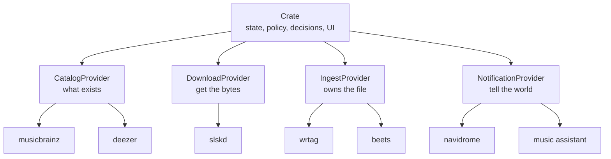

# Crate v2 — The Music Orchestrator

> **Status:** draft for review, revision 5. Leave inline comments.
>
> **⚠️ One pushback — [ingest verdict as source of truth](#the-ingest-verdict-is-a-signal-not-a-replacement).
> You already wrote an ADR that says don't do this. Overrule me if you disagree.**
>
> **🔬 Research in flight** on the default ingest provider — that section is marked and will change.

## The thesis

Crate v1 tried to do everything: find music, download it, tag it, organize it, tell other apps about it.
It's mediocre at the last three because they aren't the point.

Crate v2 does one thing: **it decides what music you should have, and orchestrates the tools that get it there.**
Everything else becomes a provider.



## What each layer owns

The boundaries matter more than the plumbing. Getting these wrong is how you end up with two things
fighting over the same file.

| Layer | Owns | Never |
| --- | --- | --- |
| **Crate** | State, the watch/wanted machine, the scheduler, user policy (quality tiers, negative keywords, upgradeability), the UI | Touches a file |
| **CatalogProvider** | What exists in the world — search, discographies, what you're missing, what to go look for | Touches a file. Its metadata is for *finding* music, not for tagging it. |
| **DownloadProvider** | Getting the bytes — protocol, peers, availability, transfer state | Decides *which* file is good enough. That's policy. |
| **IngestProvider** | **Everything about the file on disk** — tags, cover art, path, layout, format | Writes to crate's database |
| **NotificationProvider** | Telling downstream apps something changed | Anything else |

The one that's easy to get wrong: **catalog providers are search providers.** MusicBrainz and Deezer
tell crate what a discography contains and what to hunt for. They are *not* the source of truth for
what gets written into a file's tags — that's entirely the ingest provider's call.

> **Naming:** `MetadataProvider` is now actively misleading, since the ingest provider is the one
> that owns file metadata. Proposing **`CatalogProvider`**. Alternative: `SearchProvider`.
> Renaming now is cheap; renaming after third parties write providers isn't.

## Providers are language-agnostic

gRPC doesn't care what's on the other end. A provider is any process that speaks the contract —
Go, Python, Rust, whatever fits the tool it wraps.

This matters most for **beets: the provider is written in Python and imports beets directly.** No
shelling out, no PTY scraping, no parsing CLI output, no `beet import -q` and its silent skips.
`grpcio` + generated stubs, and the provider calls `beets.library` in-process.

Consequences:

- beets' Python API is explicitly internal — the maintainers state there are no stability
  guarantees. The provider pins a beets version and tests against it. That's exactly the kind of
  risk an isolated satellite repo is designed to contain.

## First-party providers never shell out

**Rule: a first-party provider never invokes a CLI per operation and parses its output.** It talks
to its tool through a library, an in-process runtime, or a real protocol.

The ban is on *output parsing*, not on process management. Crate already spawns provider binaries
and talks gRPC to them — `ProcessManager` is the existing precedent and it's fine. The distinction:

| Pattern | Verdict |
| --- | --- |
| Import the library, call functions | ✅ |
| In-process runtime (wasm, embedded interpreter) | ✅ |
| Start a long-lived server, speak HTTP/gRPC to it | ✅ — this is what crate does today |
| `exec` per operation, parse stdout / check exit codes | ❌ |
| Drive an interactive prompt | ❌❌ |

Why: arg escaping, no type safety, exit codes that lie, output formats that were never contracts,
and debugging that collapses the moment anything goes wrong. betanin is the cautionary tale —
454 stars, and it drives beets by spawning it in a pseudo-terminal and regex-matching *truncated*
prompt fragments to dodge terminal line-wrap.

**Third-party providers can do whatever they want.** The contract doesn't care. This is a standard
we hold ourselves to, not one we impose.

### Exceptions, if it comes to that

If a tool we genuinely need has no library, runtime, or protocol surface, we take an exception
rather than abandon the tool — but we take it on the record:

1. It's written down in an ADR: which tool, why no other path exists, what the failure modes are
2. It lives **only** in the satellite provider repo — crate core never shells out, no exceptions
3. It carries an **exit condition** — if upstream ever ships a library or API, we migrate
4. It's a decision, not a default. One tool, one ADR, not a blanket carve-out.

## Scope

### Deleted

| Package | Replaced by |
| --- | --- |
| `internal/services/tagger` | IngestProvider |
| `internal/services/organizer` | IngestProvider |
| `internal/services/importer` | IngestProvider (`Identify`) + crate-side reconciliation |
| `internal/naming` | IngestProvider (the ingest tool owns path templates) |
| `internal/services/navidrome` | NotificationProvider |
| `internal/services/musicassistant` | NotificationProvider + crate HTTP API for inbound |
| `internal/services/slskd` (as a hardcoded dependency) | DownloadProvider |
| `scheduler.checkFileIntegrity` | IngestProvider `Resync` |

No compatibility shims. No built-in fallback provider. v2 is a clean break.

### Built

1. **Release-candidate pipeline** — needed to dogfood everything else
2. **Provider config schema** — cross-cutting; providers declare their own settings UI
3. **`IngestProvider`** contract + a default implementation
4. **`NotificationProvider`** contract + navidrome / music-assistant providers
5. **`DownloadProvider`** contract + slskd provider
6. **State-machine refactor** — ownership moves off `file_path` onto provider refs
7. **Lidarr shim expansion** — a real goal, not a leftover

---

## Phase 0 — Release candidates

Two concrete bugs block cutting an RC today.

**`.github/workflows/ci.yml:108`** tags `type=raw,value=latest` unconditionally — an RC tag would
move `latest` to a pre-release image and auto-upgrade everyone running `:latest`.

```yaml
type=raw,value=latest,enable=${{ !contains(github.ref_name, '-') }}
```

`type=semver,pattern={{major}}.{{minor}}` already no-ops on prereleases (docker/metadata-action skips
partial patterns for them), so `2.0` won't move. No change needed there.

**`.github/workflows/release.yml`** calls `gh release create --generate-notes` with no `--prerelease`,
so an RC would publish as a full GitHub release.

```yaml
gh release create "${{ github.ref_name }}" --generate-notes \
  ${{ contains(github.ref_name, '-') && '--prerelease' || '' }}
```

**Convention:** `v2.0.0-rc.1` → `ghcr.io/theoutdoorprogrammer/crate:2.0.0-rc.1`.
The NAS compose file pins the RC tag directly; `latest` stays on v1 until v2 ships.

---

## Provider config — cross-cutting

Every provider kind gets this, not just ingest. Providers **declare their own settings** and crate
renders them.

```protobuf
rpc GetConfigSchema(Empty) returns (ConfigSchema);
rpc SetConfig(ConfigValues) returns (ConfigResult);

message ConfigField {
  string key           = 1;
  string label         = 2;
  FieldType type       = 3;  // STRING | INT | BOOL | SECRET | ENUM | TEXT
  bool required        = 4;
  string default_value = 5;
  string help          = 6;
  repeated string enum_values = 7;
}
```

What this buys:

- **The navidrome / music-assistant settings migration solves itself** — they stop being crate
  settings and become provider config, rendered from the provider's own schema. Crate can migrate
  existing values automatically on first run.
- **Secrets keep working** — `SECRET` fields inherit the existing `sensitiveSettings` redaction.
- **External providers become configurable** without env-var surgery.
- **Validation lives with the provider**, which is the only thing that knows what's valid.

Plus a **raw passthrough field** for tools with config surfaces too large to model — beets has 159
keys across 39 sections, and crate should not try to render that. The provider exposes the handful
that matter as typed fields and takes the rest as an opaque blob.

---

## IngestProvider

Crate points at a release and hands over what it knows. The provider owns everything from there.

### Methods

| Method | Kind | Purpose |
| --- | --- | --- |
| `Info` | unary | Name, version, capabilities |
| `Place` | unary | **Destructive.** File + claims in → location + ref out |
| `Identify` | **server stream** | Examine files the provider doesn't own yet — what is this? |
| `Resync` | **server stream** | Re-examine files it *does* own — what changed? |
| `Resolve` | unary | Ref in → current path + exists. Single-item lookup. |
| `Remove` | unary | Delete a file *through* the provider so its own record stays consistent |

### `Place` carries two claims, not one

Crate has two independent, possibly-conflicting ideas about what a file is:

- **`catalog_claim`** — what crate went looking for. MBID (primary when present), plus artist,
  album, title, track/disc number, year as fallback.
- **`download_claim`** — what the source said it was. Raw filename, whatever the download provider
  parsed out of it, format, bitrate, source identifier.

**Send both.** They disagree more often than is comfortable — crate's auto-download rule only
requires artist+title to appear somewhere in the path, which is a weak guarantee that the bytes are
what was wanted. A provider that can fingerprint audio is strictly better positioned to settle it
than crate is.

### Trust the claim until you know better

Default provider behavior: **if it doesn't know better, trust `catalog_claim` and use it.** Crate
downloaded this file *because* it was watching that release, so it's high-confidence. A provider that
can do better — fingerprint the audio, fetch the full release, disagree outright — should, and
should say so. One that can't just uses what it was given.

Crate points. It never dictates tag values. What lands in the file is the provider's business:
which fields to write, cover art, ReplayGain, format conversion, path layout, all of it.

### `Resync` — the provider re-checks its own work

Both leading ingest tools already have this operation natively (`beet mbsync`, `wrtag sync`), so the
contract should expose it rather than making crate reimplement it.

Crate's scheduler drives it on an interval. The provider walks what it owns and streams back deltas:
refs whose path moved, refs whose metadata changed, refs that vanished. Crate applies them.

**This replaces `scheduler.checkFileIntegrity` entirely.** Today that job stats every owned track's
path — which under v2 would see a provider-moved file as missing and re-download it forever.
`Resync` is also strictly better than calling `Resolve` in a loop: one streamed pass instead of N
round trips.

`Resolve` stays for single-item lookups where a full pass is overkill.

### The ingest verdict is a signal, not a replacement

> **⚠️ Pushing back here.**

You proposed: once the ingest provider says "this is this song," that becomes crate's source of
truth, and everything is in flux until then.

**Half right.** The provider's verdict *is* authoritative about the file. It should be stored, and
where it disagrees with the catalog claim the UI should say so. But it shouldn't overwrite crate's
catalog identity, for two reasons:

- **Gap detection breaks.** Crate knows *Discovery* has 14 tracks because a catalog provider said so,
  and tracks which of the 14 it owns. If an ingest verdict re-points a track at a different release,
  the album's track list shifts underneath and gaps appear or vanish incorrectly.
- **Catalog linkage breaks.** Entities carry `provider` + `provider_id` from the catalog provider.
  That's what answers "what else does this artist have?" An ingest provider overwriting it severs
  the thing crate exists to do.

**You already decided this exact question.** ADR-0005 stores the MusicBrainz *recording* id as a
separate signal rather than resolving it into the release-track id — same shape of problem, and the
reasoning holds: a recording id can't place a track on a specific release.

So: store the ingest verdict alongside the catalog identity, don't collapse them. **The catalog
identity is authoritative about the collection; the ingest verdict is authoritative about the file.**

The upside you're pointing at is real though, and it comes free: a persistent mismatch between the
two is a strong signal crate downloaded the wrong thing. That's a quality-control feature worth
surfacing — arguably better than silently overwriting, because the user gets to see it.

### Identity in, ref out

`Place` returns an opaque **ref** — provider-chosen, stored by crate. `Resolve` / `Remove` / `Resync`
speak in refs. The provider knows its own IDs; crate never sends identity back, because crate still
holds it in its own DB. If refs ever need rebuilding, the recovery is an `Identify` pass — machinery
v2 has to build anyway for the v1 migration.

### Per-track placement always works

Identity travels with every file, including album context. A provider handed one track of a
fourteen-track album has everything it needs to place that one track correctly.

**`Place` is per-track. Batching is an optimization, not a correctness requirement** — one cover-art
fetch per release instead of per track, one metadata lookup instead of fourteen. Providers that
prefer batches advertise it; providers that don't still work correctly.

### Capabilities are a defined enum

Not free-form strings — every provider would invent its own and crate couldn't branch on them.
Adding one is a deliberate contract change.

```protobuf
enum Capability {
  CAPABILITY_UNSPECIFIED      = 0;
  CAPABILITY_BATCH_PLACE      = 1;  // prefers whole releases (optimization)
  CAPABILITY_OFFLINE_IDENTIFY = 2;  // can identify from local tags, no network
  CAPABILITY_STABLE_REFS      = 3;  // refs survive the provider relocating files
  CAPABILITY_RESYNC           = 4;  // can re-examine and correct what it owns
}
```

### Why `Identify` and `Resync` stream

A pass over 100k files through a rate-limited external tool is measured in hours. Batching is the
provider's problem — but crate needs progress and partial results or the UI is a spinner. Streaming
gives both, and makes the pass cancellable.

### Why `Identify` needs a read-only flag

`POST /api/library/import` is non-destructive today — people click it to adopt an existing
collection. At v2 that same button hands files to a tool that moves things. First run must be able
to say look-don't-touch. A flag on the request, not a separate RPC.

### Crate never deletes files

Deletion goes through the provider so it can drop its own record first. Two callers:

- **Track rejection** (`internal/services/reject`) — `Remove(ref)` replaces `library.DeleteFile`
- **Quality upgrade** — `Remove(old_ref)` then `Place(new_file)`

Two consequences to design for:

- **The safety gate moves.** Today `library.Contains` guarantees crate never deletes outside the
  library root. That guardrail becomes the *provider's* responsibility — a third-party process is
  now trusted not to nuke things. This belongs in the contract as an explicit MUST.
- **Deletes can now fail.** `os.Remove` became a network call to a process that might be down.
  Reject needs a pending-removal state and a retry, or it has to fail loudly. It cannot silently
  mark a track `wanted` while the old file is still on disk.

### Hard boundary: providers never write to crate's DB

The provider says *what a file appears to be*. Crate decides what that means.

Entity creation needs provider IDs, ranks, and artwork from the **catalog** providers — an ingest
provider has no access to that registry and shouldn't. So `Identify` returns
`{path, title, artist, album, mbid, confidence}` and crate runs its own matching ladder
(recording ID → release-track ID → title-within-album) against its own tables.

Same boundary catalog providers already respect: they return data, crate persists it.

---

## NotificationProvider

gRPC surface stays deliberately small — `Info` + `Notify`, plus the shared config RPCs. It grows as
use cases appear.

Navidrome and Music Assistant already implement this in all but name:

```go
type PostDownloadNotifier interface {
    TriggerScan(ctx context.Context)
}
```

Lifting that to gRPC is close to mechanical, which makes it the right place to prove the v2 provider
pattern before touching the state machine.

### Inbound events go over crate's HTTP API, not gRPC

The Music Assistant reject watcher isn't a notification — it's an *inbound* signal (user drops a
track in the reject playlist → crate rejects and re-downloads it). Rather than making the gRPC
contract bidirectional, **the provider calls crate's own HTTP API**.

This inverts the dependency and costs almost nothing:

- `POST /api/tracks/reject` already exists and takes `{artist, title}` — exactly what MA hands you
- Any provider can trigger any crate action without a contract change
- The boundary holds: the provider isn't writing rows, it's calling an endpoint that runs crate's
  own reject logic (delete file, blacklist source, reset to wanted, re-enqueue)

**To solve:** providers need crate's URL injected. Trivial for in-image providers — `ProcessManager`
already sets `PORT` in their env, so `CRATE_API_URL` rides along. External providers configure it.

---

## DownloadProvider

**Provider owns protocol + availability. Crate owns policy.** *(Settled.)*

| Owner | Concern |
| --- | --- |
| **Provider** | Peer search, free upload slots, queue length, per-user shadow bans, per-(user,file) blacklist, transfer state machine, stale-transfer timeouts |
| **Crate** | Quality tiers, negative keywords, min bitrate, upgradeability, retry backoff policy |

The provider returns **ranked candidates** carrying a normalized availability score plus
format/bitrate. Crate applies policy and picks.

Two things force crate to keep tier logic regardless: it must pass tiers **down** or the provider
can't honor preferences, and it must get format+bitrate **back** or `IsUpgradeable` can't work and
the daily upgrade scan is dead. Given both, moving selection out means every provider author
re-implements crate's scoring using data crate handed them — and gets it subtly wrong. The
`TestScoringBalance` invariants (artist bonus can't flip a tier; all bonuses clear one tier gap but
not two) are user policy and would evaporate.

What genuinely belongs to the provider is anything Soulseek-shaped: free upload slots, queue depth,
whether a user is offline. Those mean nothing to a torrent or usenet provider and crate shouldn't
model them.

The provider also supplies the `download_claim` that rides along to ingest — the raw filename and
anything it parsed from it.

### Shaped for slskd, deliberately

The contract will be Soulseek-flavored and that should be written down rather than discovered.
slskd stays first-class; other implementations adapt or don't exist. Not pre-generalizing is the
right call — but it's a call, and it belongs in an ADR.

---

## The state-machine refactor

**This is the actual work. The gRPC plumbing is the easy part.**

Today ownership is welded to the filesystem:

- All three code paths that set `status = 'owned'` write `file_path` in the same statement
- `scheduler.checkFileIntegrity` stats every owned track and demotes it to `wanted` when the file is gone
- `FindTrackByPath` (the MA reject watcher) joins on `file_path`
- Quality upgrades delete the old file at its known path
- `library.Contains` gates every destructive operation

If a provider owns placement, every one of those breaks.

### The change

`tracks` gains `ingest_provider` + `ingest_ref`, mirroring how entities already store
`provider` + `provider_id` for catalog identity — plus the ingest verdict stored as its own signal
(see above). `file_path` **stays as a cache, not as truth** — so the reject path doesn't need a gRPC
round-trip per event — and `Resync` / `Resolve` are the authority when the cache is stale.

The scheduler's integrity job becomes: call `Resync`, apply the deltas.

### Migration for existing v1 users

Their library is already organized by crate's naming template, `file_path` is populated, entities
exist. v2 first-run does an `Identify` pass to establish refs. Until it completes, tracks have a path
but no ref — that needs its own state, and the integrity check must not reap them meanwhile.

---

## ADR-0007 — port it

**What it is:** when you import a folder of MP3s, crate can't tell who the artist really is, so it
creates a placeholder `local` artist. ADR-0007 is the machinery for saying *"this local thing is
actually Radiohead"* — which then pulls the real discography and surfaces what's missing.
Two files (`internal/api/reconcile.go`, `manual_link.go`) plus badges in the UI.

**Recommendation: port it.** It's crate-side reconciliation with nothing to do with tagging or
placement. Fed by `Identify` results instead of the importer's own tag scan. Without it, an imported
library is a dead list with no gap detection — which is crate's entire value proposition.

It gets *less* load-bearing in v2: a good `Identify` returns real MBIDs for well-tagged files, so
fewer imports land as `local` at all. It becomes the fallback for poorly-tagged music rather than
the main path.

---

## Lidarr shim — lean into it

The shim stays in `internal/api/lidarr.go` and the principle holds: **crate's core is never reshaped
to accommodate Lidarr.** But shim *coverage* becomes a real v2 goal, not a leftover.

The payoff is ecosystem reach — every Lidarr-compatible client, mobile app, and automation that
speaks the v1 API works against crate for free. Helmarr already does. Expanding coverage means more
tools work without crate writing a single integration.

Work: enumerate what Lidarr v1 endpoints real clients actually call, implement the gaps, and treat
the shim as a first-class supported surface with its own tests — rather than a convenience that
happens to exist.

---

## 🔬 Default ingest provider — research in flight

Two things I got wrong or under-researched, both being verified now:

**I overstated the beets case.** My "beets is weak at ingest" claim was too broad. What's actually
verified is that **`beet import -q` (the unattended CLI importer) is weak** — it only auto-applies
below a 0.04 match distance and silently skips everything else with exit code 0, even when handed an
exact MBID. But that assumed the provider drives beets' *autotagger* through its CLI. A native
Python provider calling `beets.library` directly may bypass matching entirely. Being verified.

**wrtag as the default deserves a real comparison.** ~405 stars, essentially one maintainer, and as
the sole required ingest provider its bugs become crate's bugs with no fallback. Still being
researched: wrtag's actual programmatic surface and MusicBrainz Picard's real scriptability.

### Why we're not rolling our own — settled

The tagging-library research came back and it reframes the choice.

**Multi-format tag writing in pure Go is not a solved problem** — verified by building and
round-tripping real files:

| Option | Verdict |
| --- | --- |
| `ambeloe/oggv` | Ogg **Vorbis** only, no Opus. **AGPL-3.0** — dealbreaker. 1 star, no tests. |
| `cabbagekobe/tunetag` | MIT and advertises exactly what you'd want — but **silently destroys Ogg Vorbis files**. `WriteFile` returns `nil` and the file is unreadable: its re-pager assumes each header packet starts a fresh page and drops the Vorbis setup header. Reproduced. Its own tests miss it because they synthesize idealized files. |
| `Sorrow446/go-mp4tag` | MIT, works, handles the hard `stco` chunk-offset fixup — **but the GitHub account is gone** (DMCA history). Code survives only via the Go module proxy, no maintained fork. Vendorable, never patchable. |
| `abema/go-mp4` | Alive, MIT, 546★ — parses `ilst` fully but has **no tag API**. You'd write the writer plus chunk-offset repair yourself. |
| DIY multi-library (`id3v2` + `go-flac` + `flacvorbis`) | **Empirically dead.** Actually built: MP3 and FLAC only — precisely the gap we're trying to close, still uncovered. |

**The one credible foundation is `go.senan.xyz/taglib`** — real TagLib compiled to WASM, run via
wazero. Confirmed: no cgo, no subprocess, static builds and cross-compilation work, reads *and
writes* every format we care about (MP3, FLAC, Ogg Vorbis, Opus, AAC/ADTS, M4A/ALAC, WavPack, WMA).
Tested across 11 files — **all 8 audio streams bit-identical by decoded md5 after tagging**, and
foreign tags preserved. +3.62 MB to the binary (~5% of the image). Concurrency-safe at 220 parallel
ops. The wasm blob ships with a GitHub build attestation from a reproducible-build workflow.

**And wrtag's own `tags/tags.go` is ~75 lines of pure passthrough over it.**

That's the reframe: **tagging isn't the hard part and isn't a differentiator.** Whatever we ship,
the tag layer is a thin wrapper over the same library. What wrtag adds on top is *MusicBrainz
matching and path templating* — and **crate supplies identity, so `Place` barely needs matching at
all.** Matching earns its keep in `Identify` (unknown files), not `Place`.

**The only viable Go foundation is LGPL, and MIT is non-negotiable.** `go.senan.xyz/taglib` — real
TagLib compiled to WASM via wazero — is the one library that writes every format we care about
CGO-free, and it's verified non-destructive to both foreign tags and audio bytes. It's also
**LGPL-2.1**, and static embedding triggers §6 relinking obligations. Navidrome, gonic and wrtag all
ship it, but **all three are GPL-3.0 and crate is MIT** — their precedent says nothing about our case.

So: **crate ships no tagging code.** The existing providers handle it. *(Settled.)*

That decision is doubly supported — the DIY path was dead on its own merits before licensing even
came up, and this is written down so nobody re-litigates it in six months.

### ⚠️ This makes one unanswered question blocking

**No first-party tagging + no CLI-output-parsing means the default provider needs a real
programmatic surface.** Three of them qualify, so the gate is wider than it first looks:

- **wrtag's Go packages** → `crate-ingest-wrtag` imports them, GPL contained in that repo. Best case.
- **`wrtagweb`'s HTTP API** → also fine. Starting a long-lived server and speaking HTTP to it is the
  same pattern `ProcessManager` already uses for gRPC providers. Not shelling out.
- **beets' Python API** → `crate-ingest-beets` imports `beets.library` in-process. Also fine.

Only the CLI paths are disqualified. So the open questions are about *which* default, not whether
one exists:

- **What is wrtag's actual programmatic surface** — Go packages, `wrtagweb` HTTP, or CLI only? Can
  it accept a supplied release ID instead of insisting on matching?
- **Can beets be driven as a pure organizer** via its Python API, bypassing the autotagger when
  crate supplies identity? (The verified weakness is `beet import -q` — the *CLI* importer — which
  only auto-applies below a 0.04 match distance and silently skips everything else with exit code 0,
  even handed an exact MBID. A native Python provider calling `beets.library` directly may sidestep
  that entirely.)

If both come back CLI-only, that's when the exception policy above applies — one tool, one ADR, an
exit condition, contained in the satellite repo. Worth settling before phase 3 starts either way.

### Correction to an earlier revision of this plan

I wrote that Navidrome uses go-taglib in a way that implied write-path validation. **Navidrome does
not write tags at all** — zero `WriteTags`/`WriteImage` call sites — and gonic depends on wrtag
rather than the library directly. The three converged on *reading*. The production proof for the
**write** path is wrtag alone: 405★, one maintainer.

Also worth recording: crate's existing FLAC tagger is **not** affected by the `go-flac`
duplicate-tag footgun — it replaces the comment block in place rather than appending. That
correctness came from ~100 hand-written lines, and it's the kind of thing that gets lost when the
code is deleted. Whatever ships as default must be verified to preserve ReplayGain and MusicBrainz
IDs the same way.

---

## Breaking changes for v1 users

| Change | Impact |
| --- | --- |
| `naming_template` stops working | **This was issue #1** — someone asked for it and you built it. Users reconfigure layout in the ingest tool. Existing files are never renamed, so old and new layouts coexist. |
| `navidrome_*` / `music_assistant_*` settings move to provider config | Handled by the provider config schema — crate migrates the values automatically on first run. |
| Tagging behavior changes | ADR-0004's non-destructive guarantee becomes the provider's promise, not crate's. **Whatever ships as default must be verified to preserve ReplayGain + MusicBrainz IDs** the way the current tagger does. |
| First run does a full library `Identify` pass | Slow on large libraries. Needs a progress UI. |

---

## Repos and packaging

### One repo through v2.0.0, then split

Develop v2 in the crate repo with the contract in flux, then break out satellites at release.
Contract changes during build-out would otherwise be a three-step cross-repo dance (release proto →
update N satellites → release each → bump pins) landing exactly when the contract churns daily.
Go workspaces make the eventual transition mechanical.

### The `crate` org, post-split

`crate-<kind>-<impl>`:

| Repo | Kind | Language |
| --- | --- | --- |
| `crate` | the orchestrator | Go |
| `crate-proto` | the contracts — everything depends on it | proto → many (see below) |
| `crate-catalog-musicbrainz` | catalog | Go |
| `crate-catalog-deezer` | catalog | Go |
| `crate-download-slskd` | download | Go |
| `crate-ingest-wrtag` | ingest | Go |
| `crate-ingest-beets` | ingest | **Python** |

Binaries follow the repo name, which changes the `CRATE_PROVIDERS` config format — worth landing
with v2 rather than after people have written config against the old shape.

### Stubs in as many languages as we can get cheaply

Agreed on the goal — but the cost isn't *generating* stubs (that's one `protoc` invocation anyone
can run), it's **publishing and versioning a package per language**: a Go module path, a PyPI
package, an npm package, a crate, each needing its own release pipeline kept in sync with the
contract. Hand-rolled, that's where multi-language support rots — and a stale stub three contract
versions behind is worse than no stub at all.

**`buf` solves exactly this.** Push the module to the Buf Schema Registry and it publishes generated
SDKs to Go modules, PyPI, npm, Maven, Cargo, NuGet, and Swift Package Manager automatically —
one config instead of seven pipelines.
([BSR generated SDKs](https://buf.build/docs/bsr/generated-sdks/), [consuming them](https://buf.build/docs/bsr/generated-sdks/tutorial/))

So: **the `.proto` files are the canonical artifact** — anyone can generate from them — and BSR
gives the pre-built SDKs for free on top. Crate itself only needs Go and Python; the rest cost
nothing extra.

The main image pulls release artifacts at build time. One cost to design around: **the build stops
being reproducible from one `git clone`.** Need checksum-pinned provider versions committed in the
crate repo — a lockfile, effectively — so a yanked or missing satellite release fails loudly at
build time instead of silently pulling something else.

Python providers ship as their own images rather than into the main one, so no interpreter enters
the default runtime.

### Licensing

wrtag is **GPL-3.0**; crate is MIT. Separate processes over a documented protocol is aggregation,
not linking — **crate itself stays MIT.** With the shim in `crate-ingest-wrtag`, that repo carries
the GPL and the main repo stays clean, so it can import wrtag's Go packages directly.

beets is **MIT** — no constraint at all.

---

## Sequencing

| Phase | What | Why this order |
| --- | --- | --- |
| 0 | RC pipeline | Can't dogfood v2 without it |
| 1 | Provider config schema | Cross-cutting; everything after it depends on it |
| 2 | `NotificationProvider` | Interface already exists; proves the pattern at near-zero blast radius |
| 3 | `IngestProvider` + default implementation | The hard one |
| 4 | State-machine refactor | Ships **with** phase 3 — same change |
| 5 | Second ingest provider | Validates the contract against a second implementation *and* a second language |
| 6 | `DownloadProvider` + slskd | Highest risk, least external demand |
| 7 | Lidarr shim expansion | Independent; can slot anywhere after phase 4 |
| 8 | Repo split + rebrand + docs | README, CLAUDE.md, site/index.html, site/docs.html |

Phases 3 and 4 are one unit of work, not two. Everything else can ship as an RC independently.

## ADRs to write

- Ingest as a provider — why crate exited the tagging/organizing business
- No first-party tagging code — why MIT ruled out the only viable Go library
- First-party providers never parse CLI output — the rule, and the exception policy
- Catalog vs ingest — search metadata is not file metadata
- Ownership by provider ref instead of file path
- Two claims in, one verdict out — and why the verdict doesn't overwrite catalog identity
- Inbound provider events over HTTP instead of bidirectional gRPC
- Provider-declared config schemas
- DownloadProvider shaped for Soulseek — why we didn't pre-generalize
- Where the download policy/protocol line sits

## Still open

1. **Which tool is the default ingest provider** — wrtag or beets. Blocked on two questions: wrtag's
   real programmatic surface, and whether beets' Python API can organize with supplied identity
   without the autotagger. Settle before phase 3.
2. **`MetadataProvider` → `CatalogProvider`?** Recommending the rename; "metadata" now collides with
   what ingest providers own. Cheap now, expensive after third parties write providers.
