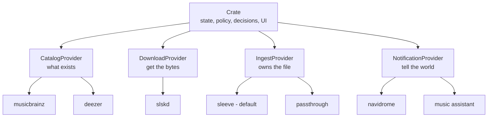

# Crate v2 — The Music Orchestrator

> **Status:** revision 6 — design settled, nothing blocking. Leave inline comments.
>
> Every open question from revisions 1–5 is resolved. Research verdicts on the tools we evaluated
> and rejected are recorded in
> [Research findings](#research-findings--recorded-so-nobody-re-litigates) so nobody re-opens them,
> and [Known gaps](#known-gaps-deliberately-carried) records what we're carrying on purpose.

## The thesis

Crate v2 does one thing: **it decides what music you should have, and orchestrates the pieces that
get it there.** Catalog, download, ingest, and notification all move behind gRPC provider contracts.

The contracts are public and documented. **What we *ship* is only what we can maintain ourselves** —
no bundled third-party tools, no wrapped CLIs, no foreign runtimes in the required path. Anyone can
write a provider for anything; that's the point of a contract.



## What each layer owns

The boundaries matter more than the plumbing. Getting these wrong is how you end up with two things
fighting over the same file.

| Layer | Owns | Never |
| --- | --- | --- |
| **Crate** | State, the watch/wanted machine, the scheduler, user policy (quality tiers, negative keywords, upgradeability), the UI | Touches a file |
| **CatalogProvider** | What exists in the world — search, discographies, what you're missing, what to go look for | Touches a file. Its metadata is for *finding* music, not tagging it. |
| **DownloadProvider** | Getting the bytes — protocol, peers, availability, transfer state | Decides *which* file is good enough. That's policy. |
| **IngestProvider** | **Everything about the file on disk** — tags, cover art, path, layout | Writes to crate's database |
| **NotificationProvider** | Telling downstream apps something changed | Anything else |

The one that's easy to get wrong: **catalog providers are search providers.** MusicBrainz and Deezer
tell crate what a discography contains and what to hunt for. They are *not* the source of truth for
what gets written into a file's tags — that's entirely the ingest provider's call.

> **Naming:** `MetadataProvider` becomes **`CatalogProvider`** in v2. "Metadata" now collides with
> what ingest providers own, and renaming is cheap before third parties write against the contract.

## First-party providers never shell out

**Rule: no `exec.Command` in any repo we own. No exceptions.**

This used to need an exception policy. It doesn't anymore — **the rule was only ever hard because we
were wrapping other people's CLIs.** Once we only ship what we control, it costs nothing. That's the
reason it can be absolute, and it's worth recording so a future session reads it as a consequence
rather than dogma.

The ban is on *output parsing*, not process management. Crate already spawns provider binaries and
talks gRPC to them — `ProcessManager` is the existing precedent and it's fine.

| Pattern | Verdict |
| --- | --- |
| Import the library, call functions | ✅ |
| In-process runtime (wasm, embedded interpreter) | ✅ |
| Start a long-lived server, speak HTTP/gRPC to it | ✅ — what crate does today |
| `exec` per operation, parse stdout / check exit codes | ❌ |
| Drive an interactive prompt | ❌❌ |

**Third-party providers can do whatever they want.** The contract doesn't care. This is a standard we
hold ourselves to, not one we impose. betanin is the cautionary tale for why — 454 stars, and it
drives beets by spawning it in a pseudo-terminal and regex-matching *truncated* prompt fragments to
dodge terminal line-wrap.

## Scope

### Moved, not deleted

| Package | Becomes |
| --- | --- |
| `internal/services/tagger` | `crate-ingest-sleeve` |
| `internal/services/organizer` | `crate-ingest-sleeve` |
| `internal/naming` | `crate-ingest-sleeve` |
| `internal/services/importer` (the tag-scan half) | `Identify`, implemented by both providers |

### Deleted

| Package | Replaced by |
| --- | --- |
| `internal/services/navidrome` | NotificationProvider |
| `internal/services/musicassistant` | NotificationProvider + crate HTTP API for inbound |
| `internal/services/slskd` (as a hardcoded dependency) | DownloadProvider |

### Stays in crate

The **reconciliation** half of the importer — entity matching, the recording-ID → release-track →
title ladder, entity creation through catalog providers, and the ADR-0007 promotion machinery. That's
crate-side logic fed by `Identify` results, and it never moves.

### Built

1. **Release-candidate pipeline** — needed to dogfood everything else
2. **Provider config schema** — cross-cutting; providers declare their own settings UI
3. **`IngestProvider`** contract + `sleeve` and `passthrough`
4. **`NotificationProvider`** contract + navidrome / music-assistant providers
5. **`DownloadProvider`** contract + slskd provider
6. **State-machine refactor** — ownership moves off `file_path` onto provider refs
7. **Lidarr shim expansion** — a real goal, not a leftover

---

## Phase 0 — Release candidates

Two concrete bugs block cutting an RC today.

**`.github/workflows/ci.yml:108`** tags `type=raw,value=latest` unconditionally — an RC tag would
move `latest` to a pre-release image and auto-upgrade everyone running `:latest`.

```yaml
type=raw,value=latest,enable=${{ !contains(github.ref_name, '-') }}
```

`type=semver,pattern={{major}}.{{minor}}` already no-ops on prereleases (docker/metadata-action skips
partial patterns for them), so `2.0` won't move. No change needed there.

**`.github/workflows/release.yml`** calls `gh release create --generate-notes` with no `--prerelease`,
so an RC would publish as a full GitHub release.

```yaml
gh release create "${{ github.ref_name }}" --generate-notes \
  ${{ contains(github.ref_name, '-') && '--prerelease' || '' }}
```

**Convention:** `v2.0.0-rc.1` → `ghcr.io/theoutdoorprogrammer/crate:2.0.0-rc.1`.
The NAS compose file pins the RC tag directly; `latest` stays on v1 until v2 ships.

---

## Provider config — cross-cutting

Every provider kind gets this. Providers **declare their own settings** and crate renders them.

```protobuf
rpc GetConfigSchema(Empty) returns (ConfigSchema);
rpc SetConfig(ConfigValues) returns (ConfigResult);

message ConfigField {
  string key           = 1;
  string label         = 2;
  FieldType type       = 3;  // STRING | INT | BOOL | SECRET | ENUM | TEXT
  bool required        = 4;
  string default_value = 5;
  string help          = 6;
  repeated string enum_values = 7;
}
```

What this buys:

- **The navidrome / music-assistant settings migration solves itself** — they become provider config
  rendered from the provider's own schema. Crate migrates existing values on first run.
- **Secrets keep working** — `SECRET` fields inherit the existing `sensitiveSettings` redaction.
- **External providers become configurable** without env-var surgery.
- **Validation lives with the provider**, the only thing that knows what's valid.
- **`naming_template` moves to sleeve's config**, so it survives v2 as a provider setting rather
  than disappearing.

Plus a **raw passthrough field** for third-party providers with config surfaces too large to model.

---

## IngestProvider

Crate points at a release and hands over what it knows. The provider owns everything from there.

### Methods

| Method | Kind | Purpose |
| --- | --- | --- |
| `Info` | unary | Name, version, capabilities |
| `Place` | unary | **Destructive.** File + claims in → location + ref out |
| `Identify` | **server stream** | Examine files the provider doesn't own yet — what is this? |
| `Resolve` | unary | Ref in → current path + exists |
| `Remove` | unary | Delete a file *through* the provider so its own record stays consistent |
| `Resync` | **server stream** | Re-examine what it owns, stream back deltas |
| `Search` | unary | Identity in → plausible unclaimed files out. Powers lost-file recovery. |
| `Found` | unary | "This file is the one for this track." Validates, adopts, returns a new ref. |

### `lost` — owned-lite

A third outcome between "have it" and "don't." A provider that can't locate a file it placed reports
`lost` rather than guessing:

- **not re-downloaded** — crate believes the file probably still exists somewhere
- **not eligible for upgrades or reject** — there's nothing to replace or delete
- **surfaced in the UI as actionable**, not buried

Recovery is `Search` → user picks → `Found`. `Search` takes the track's identity and returns
plausible unclaimed files with confidence scores; the UI shows them as suggestions and also accepts a
freeform path. `Found` validates whatever it's given — it reads the file's tags and can reject a
wildly wrong pick rather than blindly adopting it — then returns the new ref. The user can also just
mark the track `wanted` and let crate re-acquire it.

> **⚠️ One change from the review comment.** You proposed `List()` — everything the provider knows
> about — as the suggestion source. I'd make it `Search(identity)` instead. Two reasons: a lost
> file is by definition *not* in the set the provider knows about, so `List` returns the wrong
> population; and on a 100k-file library it returns 100k rows to populate a dropdown. `Search`
> is targeted, cheap, and returns the right thing. A streaming `List` is still worth having as a
> **diagnostic** — "show me everything this provider tracks" — just not as the picker source.

### Losing files is universal, not a capability

**No flag for it.** Three reasons:

- **"I never lose files" is a promise no provider can keep.** The user can always `mv` something.
  A provider that declared it would be lying the first time someone reorganizes a folder.
- **Crate must handle `lost` regardless**, so the flag gates no code — it only adds a branch and one
  more thing a third-party provider can get wrong.
- **The UI doesn't need it.** Show the recovery affordance when lost tracks exist. That's always
  accurate and can never go stale against a declared capability.

**Instead, make `Search` and `Found` required methods.** If a provider can say "lost," it must help
you recover — one that can't is a dead end. This is nearly free for `sleeve`, which already walks
its directories for `Identify`.

### Correction to what this document said one revision ago

I wrote that `sleeve` should report `wanted` for a missing file, on the reasoning that sleeve owns
placement so a missing file means the user deleted it. **That's wrong and it's dangerous.**

Someone who manually reorganizes their music folder would have every track flip to `wanted` and
crate would re-download the entire library.

So: **`lost` is the safe default for any missing file, from any provider.** `wanted` requires either
an explicit choice (passthrough's **strict** mode, whose entire purpose is that behavior) or a human
saying "yes, it's really gone." Never re-acquire on an inference.

### `Place` carries two claims, not one

Crate has two independent, possibly-conflicting ideas about what a file is:

- **`catalog_claim`** — what crate went looking for. MBID (primary when present), plus artist,
  album, title, track/disc number, year as fallback.
- **`download_claim`** — what the source said it was. Raw filename, whatever the download provider
  parsed from it, format, bitrate, source identifier.

**Send both.** They disagree more often than is comfortable — crate's auto-download rule only
requires artist+title to appear somewhere in the path, which is a weak guarantee that the bytes are
what was wanted. A provider that can fingerprint audio is better positioned to settle it than crate.

### Identity points, it doesn't dictate

Crate says *"this is track 3 of Discovery by Daft Punk."* It does **not** say *"write these exact
tag values."* What lands in the file is the provider's business: which fields to write, cover art,
ReplayGain, path layout, all of it. Default behavior: **if it doesn't know better, trust
`catalog_claim`.** A provider that can do better should, and should report what it actually wrote.

**Consequence to accept:** the tags in the file and the values in crate's DB can diverge. That's
correct behavior, not a bug — but `Identify`-based re-matching must tolerate near-misses rather than
assuming exact equality.

### The ingest verdict is a signal, not a replacement

The provider's verdict is authoritative *about the file*. It gets stored, and where it disagrees
with the catalog claim the UI should say so. It does **not** overwrite crate's catalog identity:

- **Gap detection breaks.** Crate knows *Discovery* has 14 tracks because a catalog provider said so.
  Re-pointing a track at a different release shifts the album's track list underneath it.
- **Catalog linkage breaks.** Entities carry `provider` + `provider_id` from the catalog provider.
  That's what answers "what else does this artist have?"

ADR-0005 already decided this shape of question — the MusicBrainz *recording* id is stored as a
separate signal rather than resolved into the release-track id. Same reasoning holds.

Upside that comes free: a persistent mismatch between the two is a strong signal crate downloaded
the wrong thing. Worth surfacing as quality control.

### Identity in, ref out

`Place` returns an opaque **ref** — provider-chosen, stored by crate. `Resolve` / `Remove` /
`Resync` speak in refs. Crate never sends identity back; it still holds it in its own DB.

**Both shipped providers make the ref the path**, because neither moves files behind crate's back.
The indirection exists so the contract stays honest for providers that do — adding refs later would
break every provider written against v2, and a contract that only works in-process isn't a contract.

### Per-track is crate's model

Crate downloads track-at-a-time off Soulseek. **Partial releases are the steady state, not an
exception** — some tracks simply never become available. Both shipped providers place single tracks
natively.

Providers that require a complete release declare it, and crate holds their files until the release
is complete, surfacing "waiting on 3 more tracks" rather than sitting on them silently. This is the
capability that would let someone ship a wrtag provider out of tree.

### Capabilities are a defined enum

Not free-form strings — every provider would invent its own and crate couldn't branch on them.

```protobuf
enum Capability {
  CAPABILITY_UNSPECIFIED        = 0;
  CAPABILITY_BATCH_PLACE        = 1;  // prefers whole releases (optimization)
  CAPABILITY_REQUIRES_RELEASE   = 2;  // cannot place a partial release at all
  CAPABILITY_OFFLINE_IDENTIFY   = 3;  // can identify from local tags, no network
  CAPABILITY_STABLE_REFS        = 4;  // refs survive the provider relocating files
}
```

### `Resync` is required, and integrity checking moves with it

`scheduler.checkFileIntegrity` **moves out of crate and into the providers.** Crate's scheduler calls
`Resync` on an interval and applies the deltas the provider streams back: refs whose path moved, refs
whose metadata changed, refs that vanished.

There is no crate-side fallback, and that's the point — **stat-ing a file is touching a file**, which
crate doesn't do. Leaving a filesystem walk in the scheduler would have been the one place the layer
boundary leaked.

For `sleeve` and `passthrough` the implementation is the same stat loop that lives in the scheduler
today, just relocated. For a provider that relocates files, it's a real reconciliation pass.

### Why `Identify` streams, and why it needs a read-only flag

A pass over 100k files can take hours. Streaming gives progress, partial results, and cancellation.

The read-only flag matters because `POST /api/library/import` is non-destructive today — people click
it to adopt an existing collection. Under v2 that same button hands files to a provider that may move
things. First run must be able to say look-don't-touch.

### Crate never deletes files

Deletion goes through the provider so it can drop its own record first. Two callers: track rejection
(`Remove(ref)` replaces `library.DeleteFile`) and quality upgrade (`Remove(old_ref)` then `Place`).

Two consequences to design for:

- **The safety gate moves.** Today `library.Contains` guarantees crate never deletes outside the
  library root. That becomes the provider's responsibility — an explicit MUST in the contract.
- **Deletes can now fail.** `os.Remove` became a network call to a process that might be down.
  Reject needs a pending-removal state and a retry, or it fails loudly. It cannot silently mark a
  track `wanted` while the old file is still on disk.

### Hard boundary: providers never write to crate's DB

The provider says *what a file appears to be*. Crate decides what that means. `Identify` returns
`{path, title, artist, album, mbid, confidence}` and crate runs its own matching ladder against its
own tables. Same boundary catalog providers already respect.

---

## The two shipped providers

### `crate-ingest-sleeve` — the default

A sleeve is what you put a record in: it wraps it properly and files it. This is crate's existing
tagger + organizer + naming template, extracted behind the contract.

Nothing about its behavior changes. It's non-destructive (ADR-0004), per-track, templated,
CGO-free, MIT. `naming_template` becomes its provider config.

**Keeping this is not a compromise.** The research below established it's *more* correct than the
alternatives for crate's requirement — beets' writer destroys the ReplayGain precision and
MusicBrainz IDs that ADR-0004 exists to protect.

### `crate-ingest-passthrough` — for external library managers

For anyone who wants crate to acquire music and nothing else. Answers issue #13 directly.

- **`Place`** returns the source path unchanged and writes nothing
- **`Identify`** is a real implementation, not a stub — it reads tags so crate can adopt whatever the
  external tool did with the files
- **`Remove`** deletes

**This is the harder of the two providers, not the easier one** — it has the least information. When
the user runs `beet import`, the file moves and passthrough has no hook, no shared database, and no
way to be told. So the interesting question isn't what it does, it's **how it decides a file is
still owned.**

#### Tracking modes

How much the provider trusts the disk. One config field, three values.

| Mode | Ownership means | Trade |
| --- | --- | --- |
| **strict** | The file is where I left it | Zero false positives, but re-downloads forever for anyone running an external tool. The honest default. |
| **find** | The file is *somewhere* across my configured dirs, matched by tags | Kernald's case. Walks staging **and** a configurable library dir, reconciling by the same recording-ID → release-track → title ladder crate's importer already uses. Heuristic — loses files retagged beyond recognition. |
| **ledger** | I downloaded it once; that's enough | Zero filesystem work, zero false re-downloads. Crate becomes a *download ledger*, not a library index. |

**find** mode is exactly what issue #13 asked for — *"consider files in both that download folder and
the library when computing what is already owned"* — so the requested behavior and the mechanism
that makes passthrough work are the same thing.

**ledger mode has a consequence that must surface in the UI:** with no file to replace and nothing to
`Remove`, **quality upgrades and track rejection become no-ops.** That's legitimate for someone whose
external tool owns the library — "don't grab this twice" is the whole semantic they need — but crate
must say so rather than showing controls that silently do nothing.

#### The push channel — orthogonal to all three

Tools that can run a command on import can tell the provider directly. passthrough exposes an
**inbound HTTP endpoint** alongside its gRPC surface; when something posts a file's new location and
status, that's authoritative and overrides whatever the tracking mode would have concluded.

It layers on *any* mode rather than replacing them, because a push channel that's the only source of
truth breaks silently the day someone fat-fingers their hook config. Push when it fires, configured
mode when it doesn't.

**Ship it as a generic endpoint, not a beets feature.** beets' `hook` plugin runs a command on
`item_imported`, so the user points it at the endpoint — but any tool that can run a command on
import drives the same thing. The beets recipe belongs in the docs; the name doesn't belong in the
code. Naming it after beets is the exact coupling issue #13 warned against.

This adds a port and a shared secret to passthrough's config schema. Precedented — crate serves both
gRPC and HTTP today.

#### Why this stays inside the provider

Crate always calls `Resync` and applies whatever comes back. **ledger** mode always answers
"everything's fine," **strict** stats, **find** walks. Crate needs zero special-casing and the modes
stay a provider config field.

The one thing crate does need: because passthrough doesn't declare `CAPABILITY_STABLE_REFS`, a
vanished file goes to a *lost, pending rediscovery* state rather than straight to `wanted`. Without
that, `Resync` sees the staging file gone, marks it `wanted`, and re-downloads a track sitting
happily in the library.

**Documented limitation, not hidden:** in **find** mode, if the external tool retags a file beyond
recognition and crate holds no MBID for it, crate loses track and eventually re-downloads. That's
inherent to not controlling placement. A decoded-audio-stream hash would survive any retag exactly,
but it means decoding every file — a robustness upgrade for later, not v2.

passthrough is also the contract's best stress test: a provider that refuses to place anything proves
the contract doesn't assume placement.

---

## Issue #13 — the staging problem

The requester's spec, in his own words, is three things:

1. No automatic import, no auto-tagging or renaming in the existing library
2. A download folder distinct from the library
3. **Count files in *both* the download folder and the library when computing what's already owned**

Point 3 is the one that's easy to miss and it's load-bearing. Without it: crate downloads a track,
passthrough leaves it in staging, the integrity check sees no file at the expected library path,
marks it `wanted`, and **re-downloads it forever**.

So the staging state is not cosmetic:

- A new track state between `downloading` and `owned` — call it `staged`. The file is acquired,
  crate stops re-queueing it, and the UI honestly says "waiting on your importer."
- A scheduled `Identify` pass over the staging dir **and** the library. When the external tool
  imports the file, crate's next pass adopts it and `staged` → `owned`.
- The integrity check must understand externally-managed tracks and not reap them.

He also explicitly declined a beets integration: *"I'm not sure it would bring much value, for the
cost of tying this to beets specifically."* Recorded here because it's the clearest statement of why
crate ships no third-party ingester.

---

## NotificationProvider

gRPC surface stays small — `Info` + `Notify`, plus the shared config RPCs. Navidrome and Music
Assistant already implement this in all but name (`PostDownloadNotifier.TriggerScan`), which makes it
the right place to prove the v2 provider pattern before touching the state machine.

### Inbound events go over crate's HTTP API, not gRPC

The Music Assistant reject watcher isn't a notification — it's an *inbound* signal (user drops a
track in the reject playlist → crate rejects and re-downloads it). Rather than making the gRPC
contract bidirectional, **the provider calls crate's own HTTP API**.

- `POST /api/tracks/reject` already exists and takes `{artist, title}` — exactly what MA hands you
- Any provider can trigger any crate action without a contract change
- The boundary holds: the provider isn't writing rows, it's calling an endpoint that runs crate's
  own reject logic

**To solve:** providers need crate's URL injected. Trivial for in-image providers — `ProcessManager`
already sets `PORT` in their env, so `CRATE_API_URL` rides along. External providers configure it.

---

## DownloadProvider

**Provider owns protocol + availability. Crate owns policy.**

| Owner | Concern |
| --- | --- |
| **Provider** | Peer search, free upload slots, queue length, per-user shadow bans, per-(user,file) blacklist, transfer state machine, stale-transfer timeouts |
| **Crate** | Quality tiers, negative keywords, min bitrate, upgradeability, retry backoff policy |

The provider returns **ranked candidates** carrying a normalized availability score plus
format/bitrate. Crate applies policy and picks. It also supplies the `download_claim` that rides
along to ingest.

Two things force crate to keep tier logic regardless: it must pass tiers **down** or the provider
can't honor preferences, and it must get format+bitrate **back** or `IsUpgradeable` can't work.
Given both, moving selection out means every provider author re-implements crate's scoring and gets
it subtly wrong. The `TestScoringBalance` invariants are user policy and would evaporate.

**Shaped for slskd, deliberately.** The contract will be Soulseek-flavored. slskd stays first-class;
other implementations adapt. Not pre-generalizing is the right call — but it's a call, and it belongs
in an ADR.

---

## The state-machine refactor

**This is the actual work. The gRPC plumbing is the easy part.**

Today ownership is welded to the filesystem: all three code paths that set `status = 'owned'` write
`file_path` in the same statement, `checkFileIntegrity` stats every owned track, `FindTrackByPath`
joins on it, quality upgrades delete the old file at its known path, and `library.Contains` gates
every destructive operation.

### The change

`tracks` gains `ingest_provider` + `ingest_ref`, mirroring how entities already store
`provider` + `provider_id` for catalog identity, plus the ingest verdict as its own signal.
`file_path` **stays as a cache, not as truth**, so the reject path doesn't need a round-trip per
event.

Two new statuses join `wanted` / `downloading` / `owned`:

| Status | Meaning | Re-download? | Upgrade / reject? |
| --- | --- | --- | --- |
| `staged` | Acquired, sitting where the provider left it, waiting on an external tool | No | No |
| `lost` | Provider placed it but can't locate it now | No | No — needs `Search` → `Found`, or a human marking it `wanted` |

The invariant that matters: **crate never re-acquires on an inference.** `wanted` comes from an
explicit provider mode or a human, never from "I looked and didn't see it."

### Migration for existing v1 users

Their library is already organized by crate's naming template and `file_path` is populated. Because
`sleeve` is behavior-identical to v1's organizer and makes the ref the path, **this migration is
close to trivial** — refs backfill from existing paths. That's a real dividend of shipping our own
default rather than a foreign tool.

---

## ADR-0007 — port it

When you import a folder of MP3s, crate can't tell who the artist really is, so it creates a
placeholder `local` artist. ADR-0007 is the machinery for saying *"this local thing is actually
Radiohead"* — which pulls the real discography and surfaces what's missing.

**Port it.** It's crate-side reconciliation with nothing to do with tagging or placement, fed by
`Identify` results instead of the importer's own tag scan. Without it, an imported library is a dead
list with no gap detection — which is crate's entire value proposition.

---

## Lidarr shim — lean into it

The shim stays in `internal/api/lidarr.go` and the principle holds: **crate's core is never reshaped
to accommodate Lidarr.** But shim *coverage* becomes a real v2 goal.

The payoff is ecosystem reach — every Lidarr-compatible client and automation that speaks the v1 API
works against crate for free. Helmarr already does. Work: enumerate what endpoints real clients
actually call, implement the gaps, and treat the shim as a first-class supported surface with its own
tests.

---

## Research findings — recorded so nobody re-litigates

Both candidates for a bundled third-party ingester were evaluated by writing and running code, not
reading docs. Both failed, for different reasons.

### wrtag — structurally incompatible

- ✅ **Is** a real importable Go library. `internal/` holds only CLI plumbing. Compiles CGO-free,
  cross-compiles, and `useMBID` short-circuits straight to `GetRelease` with no search.
- ❌ **Cannot place a single track.** `wrtag.go:176` returns `ErrTrackCountMismatch` unconditionally,
  *above* the import-condition switch, so `Always` can't bypass it. Grepped the whole codebase:
  **zero singleton, partial, or incomplete handling anywhere.** Two commands, both directory-scoped.
  On a partial album the CLI matches, prints a diff and research links, and moves nothing.
- ❌ **GPL-3.0**, no linking exception.
- ❌ `wrtagweb` is an htmx hypermedia app, not an API — zero JSON encoders, `POST` returns no job ID
  or Location header, destination path exists only interpolated into HTML.
- ❌ A CoverArtArchive hiccup aborts the entire ingest (`wrtag.go:226` treats non-404 CAA errors as
  fatal). Reproduced twice against real archive.org 500s.

**Why it can't work here:** every release-oriented tagger is built on MusicBrainz's release-centric
model, and the *arr ecosystem gets complete releases by construction — a torrent or usenet indexer
ships a full album as one artifact. Soulseek is per-file. Crate is genuinely the different case.

### beets — destroys the tags ADR-0004 exists to protect

- ✅ The Python API **does** organize with supplied metadata — no autotagger, no network, verified
  with sockets hard-blocked. Singletons and partial albums are first-class (1-of-14 placed clean).
  Path templating is a real language. `Identify` is world-class. MIT.
- ❌ **`Item.write()` is destructive.** A pure no-op round trip mutated **17 tags on FLAC, 10 on
  MP3**: `REPLAYGAIN_TRACK_PEAK 0.98765432 → 0.987654`, injected `BPM=0` / `COMPILATION=0` /
  `DATE=0000`, fabricated `iTunNORM`. There is no field-subset write in the API.
- ❌ **API stability is bad.** Six breaking changes shipped in *minor* releases, at least four with
  no changelog entry. Pinning is insufficient — all 14 core deps are `>=` with no upper bounds.
- ❌ Supplying the release MBID does **not** bypass scoring, at the API level as well as the CLI:
  3-of-17 with the correct MBID scored dist=0.5510 with `missing_tracks` dominating.

### The Go tagging library landscape

Relevant if the format gap is ever closed: **no permissively-licensed pure-Go library correctly
writes both Ogg Vorbis and Opus.** `ambeloe/oggv` is AGPL and Vorbis-only. `cabbagekobe/tunetag` is
MIT but **silently destroys Ogg Vorbis files** — `WriteFile` returns `nil` and the file is
unreadable, because its re-pager drops the Vorbis setup header. `Sorrow446/go-mp4tag` works but its
GitHub account is gone. The only complete option is `go.senan.xyz/taglib` (TagLib as wasm via
wazero) — **LGPL-2.1**, which is why the format gap stays open.

**But the licensing picture is better than it first looks.** TagLib upstream ships **both**
`COPYING.LGPL` and `COPYING.MPL` — it's dual-licensed LGPL-2.1 **or** MPL-1.1 at the recipient's
option, and GitHub simply labels it LGPL. MPL-1.1 is file-level copyleft: publish changes to
MPL-covered files, but linking into a differently-licensed work is explicitly fine. **TagLib itself
was never the obstacle.**

The obstacle is Senan's Go wrapper, which declares LGPL-2.1 only. Which makes the ask specific and
easy to say yes to — see Still open.

Worth knowing if anyone builds a beets provider out of tree: **`mediafile`** — the tag library beets
itself sits on — is **MIT** and does not have the destructive-write problem. beets' `Item.update()`
nulling unset fields is what causes it.

---

## Breaking changes for v1 users

| Change | Impact |
| --- | --- |
| `navidrome_*` / `music_assistant_*` settings move to provider config | Handled by the provider config schema — crate migrates values automatically on first run |
| `naming_template` moves to sleeve's provider config | Same value, new home. Behavior unchanged. |
| `CRATE_PROVIDERS` config format changes | Provider naming convention lands with v2 |
| Enabling Music Assistant still needs a restart | Unchanged from v1 |

**Notably absent:** tagging and layout behavior. Because `sleeve` *is* the v1 organizer, existing
libraries keep working and nothing gets renamed.

---

## Repos and packaging

### One repo through v2.0.0, then split

Develop v2 in the crate repo with the contract in flux, then break out satellites at release.
Contract changes during build-out would otherwise be a three-step cross-repo dance landing exactly
when the contract churns daily. Go workspaces make the eventual transition mechanical.

### The `crate` org, post-split

`crate-<kind>-<impl>`:

| Repo | Kind |
| --- | --- |
| `crate` | the orchestrator |
| `crate-proto` | the contracts — everything depends on it |
| `crate-catalog-musicbrainz` | catalog |
| `crate-catalog-deezer` | catalog |
| `crate-download-slskd` | download |
| `crate-ingest-sleeve` | ingest (default) |
| `crate-ingest-passthrough` | ingest |

All first-party, all Go, all MIT, all CGO-free. No foreign runtime enters the image.

The main image pulls release artifacts at build time. One cost to design around: **the build stops
being reproducible from one `git clone`.** Need checksum-pinned provider versions committed in the
crate repo — a lockfile, effectively — so a yanked or missing satellite release fails loudly.

### Stubs in as many languages as we can get cheaply

The cost isn't *generating* stubs — that's one `protoc` invocation. It's **publishing and versioning
a package per language**, and hand-rolled, that's where multi-language support rots.

**`buf` solves exactly this.** Push to the Buf Schema Registry and it publishes generated SDKs to Go
modules, PyPI, npm, Maven, Cargo, NuGet, and Swift Package Manager automatically — one config instead
of seven pipelines. ([BSR generated SDKs](https://buf.build/docs/bsr/generated-sdks/))

The `.proto` files stay the canonical artifact; BSR gives pre-built SDKs on top.

---

## Sequencing

| Phase | What | Why this order |
| --- | --- | --- |
| 0 | RC pipeline | Can't dogfood v2 without it |
| 1 | Provider config schema | Cross-cutting; everything after depends on it |
| 2 | `NotificationProvider` | Interface already exists; proves the pattern at near-zero blast radius |
| 3 | `IngestProvider` contract + `sleeve` | Extraction, not a rewrite — behavior must be identical |
| 4 | State-machine refactor | Ships **with** phase 3 — same change |
| 5 | `passthrough` + `staged` state | Closes issue #13; validates the contract against a second shape |
| 6 | `DownloadProvider` + slskd | Highest risk, least external demand |
| 7 | Lidarr shim expansion | Independent; can slot anywhere after phase 4 |
| 8 | Repo split + rebrand + docs | README, CLAUDE.md, site/index.html, site/docs.html |

Phases 3 and 4 are one unit of work. Everything else can ship as an RC independently.

## ADRs to write

- Ingest as a provider — why the seam exists even though we ship both implementations
- Why crate ships no third-party ingester — wrtag can't do partial releases, beets destroys foreign tags
- First-party providers never shell out — and why the rule needs no exceptions once we only ship our own
- Catalog vs ingest — search metadata is not file metadata
- Ownership by provider ref instead of file path
- Two claims in, one verdict out — and why the verdict doesn't overwrite catalog identity
- Inbound provider events over HTTP instead of bidirectional gRPC
- Provider-declared config schemas
- DownloadProvider shaped for Soulseek — why we didn't pre-generalize

## Known gaps, deliberately carried

Neither of these blocks v2. Recorded so they're a choice rather than an oversight.

**Format coverage.** `sleeve` inherits v1's behavior exactly: tags MP3, FLAC and WAV; silently
no-ops on ogg/opus/aac/m4a. Not a v2 concern.

Two notes for whenever it *is* one. First, the downloader currently **accepts formats the tagger
can't handle**, so a user can end up with untagged files in their library — a small standalone bug
worth its own issue, independent of all of this. Second, if closing the gap ever matters, the
licensing path is easier than it looks: TagLib upstream is dual-licensed LGPL-2.1 **or** MPL-1.1
(it ships both `COPYING.LGPL` and `COPYING.MPL`), and MPL permits linking into an MIT work. Only
Senan's Go wrapper is LGPL-only — so the options are ask him to match his own upstream, or write a
fresh MIT wrapper over the MPL-licensed wasm blob. Never blocked, just not needed today.

**Naming template expressiveness.** `sleeve` inherits 7 tokens and one modifier. Issue #1 proved
users care about layout control, so this will come up. Backlog.
