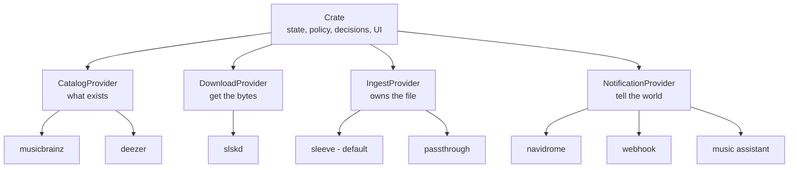

# Crate v2 — The Music Orchestrator

> **Status:** revision 8.
> Revision 7 was rewritten against a twelve-section audit; revision 8 answers a thirteenth, adversarial review of the whole.
> See [`FINDINGS.md`](FINDINGS.md) for the evidence: ~30 defects in shipped v1 code, ~20 corrections to earlier revisions of this plan, and the contract gaps behind the rewrite.
>
> **What changed in 8:** provider locality became probe-gated instead of categorical, which is what makes the community story real rather than nominal.
> The state model ships alone, ahead of the sleeve extraction.
> The `status → (watch_state, ingest_state)` mapping is decided, and `tracks.status` is dropped.
> Issue #12 is no longer claimed as closed by the FLAC fix — it isn't.
>
> **v2 is a true major release.** Nothing is preserved for compatibility's sake. Migration from v1
> is best-effort and **one-way** — which makes the pre-migration database backup load-bearing, not
> a nicety.

## The thesis

Crate v2 does one thing: **it decides what music you should have, and orchestrates the pieces that
get it there.** Catalog, download, ingest, and notification all move behind gRPC provider contracts.

The contracts are public and documented. **What we *ship* is only what we can maintain ourselves** —
no bundled third-party tools, no wrapped CLIs, no foreign runtimes in the required path.



**All first-party providers ship in one Docker image**, spawned as child processes exactly as today.
The repo layout is a *source* concern; the runtime is unchanged. This is what preserves filesystem
locality for free — see [Provider locality](#provider-locality).

## What each layer owns

| Layer | Owns | Never |
| --- | --- | --- |
| **Crate** | State, the watch machine, the scheduler, user policy (quality tiers, negative keywords, upgradeability), the UI | Touches a file |
| **CatalogProvider** | What exists in the world — search, discographies, what you're missing | Touches a file. Its metadata is for *finding* music, not tagging it. |
| **DownloadProvider** | Getting the bytes — protocol, peers, availability, transfer state | Decides *which* file is good enough. That's policy. |
| **IngestProvider** | **Everything about the file on disk** — tags, cover art, path, layout | Writes to crate's database |
| **NotificationProvider** | Telling downstream apps something changed | Anything else |

`MusicProvider` → **`CatalogProvider`**. (The name in earlier revisions of this plan,
`MetadataProvider`, never existed — see FINDINGS C3.) "Metadata" now collides with what ingest
providers own, and the rename is 11 Go references in 5 files.

## First-party providers never shell out

**No `exec.Command` in any repo we own. No exceptions.**

The rule was only ever hard because we were wrapping other people's CLIs. Once we ship only what we
control, it costs nothing. The ban is on *output parsing*, not process management — crate already
spawns provider binaries and talks gRPC to them.

| Pattern | Verdict |
| --- | --- |
| Import the library, call functions | ✅ |
| In-process runtime (wasm, embedded interpreter) | ✅ |
| Start a long-lived server, speak HTTP/gRPC to it | ✅ — what crate does today |
| `exec` per operation, parse stdout / check exit codes | ❌ |
| Drive an interactive prompt | ❌❌ |

Third-party providers may do whatever they want. This is a standard we hold ourselves to.

---

## The state model

**This is the biggest single change in v2, and it's a redesign rather than an extension.**

`tracks.status` currently conflates three orthogonal things: watch intent (`wanted`/`ignored`), acquisition progress (`downloading`), and possession (`owned`).
v2 needs to add possession-without-placement, possession-without-location, and pending-removal — and the audit found **three different predicates with three different memberships** already straining against one enum.

**The clinching evidence is a v1 bug, not a v2 requirement.**
During a quality upgrade, `scanForUpgrades` sets an owned track to `wanted` while its file is still on disk.
For that entire window crate is lying about possession: progress bars dip, Lidarr reports `hasFile: false`, the integrity check skips the file, and an upgrade that exhausts its retries strands the track `wanted`-with-a-file forever.
**One enum physically cannot hold "I have this" and "I'm getting a better one" at the same time.**
That's not a v2 problem being designed around — it's a v1 defect the current model cannot express its way out of.

So split the axes.

```sql
watch_state   TEXT NOT NULL   -- wanted | ignored
ingest_state  TEXT            -- NULL | placing | placed | staged | lost | pending_removal
```

`owned` stops being a stored value and becomes a **derived predicate**.

| Predicate | Means | Definition |
| --- | --- | --- |
| `Acquired` | "do I have this?" — progress, Lidarr `hasFile` | `ingest_state IN (placed, staged, lost)` |
| `Missing` | "is this a gap?" — download eligibility | `watch_state = wanted AND ingest_state IS NULL` |
| `Manageable` | "can I upgrade / reject / delete this?" | `ingest_state = placed` |
| `InFlight` | acquisition in progress | an active `download_queue` row, or `ingest_state = placing` |

### `ingest_state` values

| Value | Meaning | Re-download? | Upgrade / reject? |
| --- | --- | --- | --- |
| `NULL` | Crate has no file for this track | Yes, if `watch_state = wanted` | — |
| `placing` | Durable marker written **before** `Place` is called | No | No |
| `placed` | Provider owns it and can resolve it | No | Yes |
| `staged` | Acquired, left where the provider found it, waiting on an external tool | No | No |
| `lost` | Provider placed it and can't locate it now | No | No — needs `Search`→`Found`, or a human |
| `pending_removal` | `Remove` requested, not yet confirmed | No | No |

### Two invariants, both non-negotiable

1. **Crate never re-acquires on an inference *it* made.** `wanted` comes from an explicit provider
   mode or a human — never from "I looked and didn't see it." A provider *may* declare a file gone,
   and that declaration is authoritative; the contract carries a MUST that providers not declare
   loss cheaply.
2. **Crate never deletes on an inference.** The sibling rule, missing from earlier revisions —
   and the more expensive of the two to get wrong, precisely because v2 removes the global
   `library.Contains` gate that enforces it today.

### The rule that makes this survivable

**Delete every raw `status == "owned"` string comparison.** There are ~20 across Go, SQL and
TypeScript. Replace them with `models.Acquired(t)` / `models.Manageable(t)` and their SQL
equivalents. This is not cleanup — it is the mechanism that prevents the failure mode the audit
identified as most likely: forget one call site and a track becomes **invisible** in progress, in
Lidarr, in path lookup, on the artist page. Nobody reports a track they can't see.

---

## Scope

### Moved

| From | To |
| --- | --- |
| `internal/services/tagger`, `organizer`, `naming` | `crate-ingest-sleeve` |
| `internal/services/importer` (tag-scan half) | providers' `Identify` |
| `internal/library` (`ResolvePath`, `Contains`) | shared `pathsafe` package next to the proto |
| `internal/services/slskd` | `crate-download-slskd` |
| `internal/services/navidrome`, `musicassistant` | notification providers |
| `scheduler.checkFileIntegrity` | providers' `Resync` |

Roughly **1,750 lines move, ~200 rebuild, ~50 delete**. That ratio is the evidence "extraction, not
rewrite" is honest.

### Stays in crate

The **reconciliation** half of the importer — entity matching, the recording-ID → release-track →
title ladder, entity creation through catalog providers, and the ADR-0007 promotion machinery.
Crate-side logic fed by `Identify` results. It never moves.

### Deleted

`library.DeleteFile` (all callers become `Remove(ref)`) · `retryOrganize` (replaced, not ported —
it has never worked) · `organizer.findFile` (the download provider supplies the real path) ·
`ListOwnedTracksWithPaths` · six dead settings keys · `config.DownloadFormatPreference` and
`MinBitrate` (set, never read).

---

## Phase 0 — Foundation

**Ships as v1.x releases. No v2 tag yet.** Three groups, all independently valuable.

### Release pipeline

| Fix | Why |
| --- | --- |
| Guard `latest` on prereleases: `type=raw,value=latest,enable=${{ !contains(github.ref_name, '-') }}` | An RC tag would otherwise move `latest` and auto-upgrade everyone into a one-way migration |
| Rewrite the release step as a **block scalar** with `env:` | The version in revision 6 was broken in *both* branches — verified empirically. See FINDINGS C5 |
| Add `--notes-start-tag` for GA releases | `--generate-notes` uses the previous *release*, so v2.0.0's notes would cover only `rc.N → GA` |
| Add a `{{major}}` docker tag | Nobody can pin `:1` or `:2` today, while the README recommends `:latest` |
| **Back up the DB before `goose.Up`** | 256 KB copy. With a one-way migration this **is** the rollback path |
| `go test -race -timeout 10m ./...` | Without `-timeout`, a hung handshake burns CI to GitHub's 6h ceiling |
| Cross-compile instead of QEMU; `-trimpath -s -w` | Everything is `CGO_ENABLED=0`, so Go cross-compiles natively. ~31% smaller binaries and no emulation |
| `.dockerignore`, `LICENSE`, `cmd/crate/dist/.gitkeep`, pinned CI tool versions | A fresh clone currently **cannot build**, and the repo has no license while the plan claims "all MIT" |

### The contract module — before any v2 tag

Go requires a `/v2` module path suffix at major version ≥ 2, and `+incompatible` does not apply to
modules with a `go.mod`. **After the first v2 tag, `go get .../proto/provider@latest` silently
resolves to v1.20.1 forever.**

Fix without a repo split: make `proto/` a **nested Go module**. Same repo, same clone, and the
contract module stays at v1 regardless of crate's major version.

Land `buf lint` + `buf breaking` in the same pass. The existing proto fails **5 of 6** buf STANDARD
rules — package/directory mismatch, `SERVICE_SUFFIX`, request/response naming, a shared request
message. Those are contract breaks, and this is the only free window to make them.

Stub publishing goes to **GitHub Packages**, not BSR. Go needs nothing (public repo, module proxy);
npm/Maven/NuGet are covered; Python and Rust aren't supported there and those authors run
`buf generate` against the committed `.proto`. Don't promise packages we can't publish.

### v1 bugs that must be fixed before extraction

Carrying these across a process boundary makes each one strictly harder to diagnose. Full list and
citations in [`FINDINGS.md`](FINDINGS.md#ship-now--v1-bugs).

- **`retryOrganize`** — never worked in either branch; a crash mid-organize wedges the row forever
- **slskd's `DownloadFileComplete` webhook** — slskd already knows the local path; wiring it deletes
  `findFile`'s basename collision, the `track.FilePath` in-memory hack, and the downloads-dir
  must-match constraint
- **`flac.ParseFile` → `ParseMetadata`** — reading one comment currently pulls the whole file through RAM
- **Issue #12 properly.** An earlier revision claimed `ParseMetadata` closes it. It does not. The issue has three distinct failure classes: ID3v2-prefixed FLAC (9 of 16 skips, needs an ID3-skip shim before `go-flac`), ID3v2.2 MP3s (`bogem/id3v2` doesn't support them), and the sync-code error (2 files). `ParseMetadata` fixes only the third. Ship the FLAC change alone and close #12, and the reporter's actual complaint — 11 of 13 files — is still broken.
- **The upgrade-window ownership lie.** `scanForUpgrades` flips an owned track to `wanted` while its file is still on disk. For the whole window progress dips, Lidarr reports `hasFile: false`, and the integrity check skips it — and an upgrade that exhausts its retries strands the track `wanted`-with-a-file permanently. This is a v1 bug in its own right and it's also the sharpest argument for the state model below.
- **`mergeAlbum` drops `mb_recording_id`**, and has no transaction
- **`copyFile` leaves a truncated destination**; **`tagWAV` truncates in place**
- **Relink ignores the chosen provider**; **settings save rewinds the upgrade scanner**
- **`TestScoringBalance` doesn't test the scoring path** — rewrite it before anything touches scoring
- **Characterization test on `checkFileIntegrity`** pinning today's missing→`wanted`, so v2's
  inversion is a visible, reviewable test edit

---

## Phase 1 — Provider substrate

Everything downstream sits on this.

### Kind-aware registry

The registry is a flat `map[string]*providerConn` holding a `pb.MusicProviderClient`. **There is no
concept of provider kind anywhere** — not in config, not in `Info`, not in the DB, not in the UI. So
the Settings "Default Provider" dropdown would happily offer `sleeve` as your catalog provider, and
nothing validates it.

- **Kind comes from `Info`, not config.** This removes a breaking change rather than adding one.
- `ListProviders` filters by kind; `provider_primary` is validated against registered *catalog*
  providers.
- `external` is **refused for ingest providers**, loudly, at startup.
- Malformed `CRATE_PROVIDERS` entries fail loudly instead of silently vanishing.
- Providers start in **parallel** with one shared deadline, and a missing *ingest* provider is fatal
  to the download pipeline rather than a warning.

### Config transport (not schema)

`SetConfig(ConfigValues) → ConfigResult{ok, field_errors[]}`, plus `needs_config` +
`status_message` on `Info`.

- **Crate stores the values**, in the existing settings table under `provider:<id>:<key>`. If the
  provider owned them, a bad config that stops the provider would be unfixable — the thing you need
  to reach is the thing that won't start.
- **Persist first, push after.** Saving must never be gated on provider reachability.
- **`SetConfig` is pushed on every settings save, not only at startup**, and the contract MUSTs that
  it takes effect without a restart. Eight settings hot-reload today; every one silently regresses
  otherwise.
- Provider state becomes **three-valued** — unreachable / needs-config / ready. Collapsing
  "unconfigured" into "unhealthy" would badge every entity from a fresh provider as orphaned.
- Secrets never travel in provider env (`cmd.Env` currently hands every provider crate's *entire*
  environment, `CRATE_SLSKD_API_KEY` included).

**`GetConfigSchema` and dynamic form rendering are deliberately deferred to phase 9.** Designed now,
the schema would be derived from navidrome's three string fields — which is exactly how revision 6
ended up with `BOOL` and `TEXT` (zero users) and no `PATH` type (four users, and the only type with
dangerous validation semantics).

### Test harness seam

`NewServer(deps)` and `newTestEnv(t, ...envOpt)`. `api.NewServer` constructs `importer` and `reject`
internally — the two things that become provider calls — so **there is no seam to inject a fake
ingest provider today**. All 128 call sites pass no arguments, so a variadic signature breaks zero
test bodies. Doing this in phase 1 means the harness surgery happens before ownership semantics
invert, not during.

---

## Phase 2 — NotificationProvider

`Info` + `Notify` + config RPCs. Two implementations:

- **`crate-notify-navidrome`** — a 79-line move.
- **`crate-notify-webhook`** — ~60 new lines, and it serves the long tail (Jellyfin, Plex, Emby,
  n8n, a shell script) that a gRPC-only contract would strand.

Navidrome alone wouldn't prove the contract; a second *shape* does.
And webhook can't replace Navidrome, because Navidrome's auth is `md5(password + fresh salt)` per call — no static URL expresses that.

**The webhook is the documented third-party path, and that should be stated rather than left implicit.**
A shell script can receive a webhook; it cannot implement a gRPC service.
So the gRPC notification contract exists for providers that genuinely need a long-lived process — Music Assistant's persistent websocket is the only current example — and everyone else points the webhook at whatever they want.
Nobody should implement a gRPC notifier to trigger a rescan, and the docs should say so.

**Music Assistant stays in-tree through phase 7.** Its notifier and reject watcher share one
websocket; splitting them across processes means two MA connections. The reject watcher is also
entangled with the state model, which hasn't landed yet.

### Fan-out semantics

Today the fan-out is a bare synchronous loop that runs **before** the download is marked complete,
with an interface that cannot return an error. Contract: **concurrent, 5s hard deadline each,
fire-and-forget, after completion, errors logged and surfaced in provider health, never retried,
never blocking.** Crate doesn't care if a notify fails — but the user does, so it has to be visible.

---

## Phase 3 — Ingest contract + `passthrough` (ledger)

**Ledger-mode passthrough is the conformance canary, and it ships before sleeve.**

It exercises every RPC in ~150 lines with zero state-machine risk: `Place` returns the source path, `Resync` reports nothing, `Identify` reads tags, `Remove` refuses.
Running the contract against a provider that *refuses to place anything* proves the contract doesn't assume placement — while changing the proto is still free.

**It is built and conformance-tested here, not yet selectable.**
Passthrough produces `staged`, which doesn't exist until phase 4, and the in-process organizer is still the live ingest path throughout this phase.
That's the point: the contract gets exercised by a real second implementation before either the state model or the extraction is at risk.
It becomes a selectable provider in phase 5, once both have landed.

### Methods

| Method | Kind | Purpose |
| --- | --- | --- |
| `Info` | unary | Name, kind, version, **contract version**, capabilities |
| `CheckAccess` | unary | Registration-time probe that crate and the provider see the same paths |
| `Place` | unary | **Destructive.** File + claims + idempotency key in → ref, disposition, outcome |
| `Identify` | server stream | Examine files the provider doesn't own yet |
| `Resync` | server stream | Re-examine what it owns; stream deltas |
| `Resolve` | unary | Ref in → current path + exists |
| `Remove` | unary | Delete *through* the provider so its own record stays consistent |
| `Search` | unary | Identity in → plausible unclaimed files out |
| `Found` | unary | "This file is the one." Validates, adopts, returns a new ref |

### `CheckAccess` — the highest-value addition in the section

The failure users actually hit isn't a remote host. It's **two co-located containers mounting the
same host directory at different container paths** — `/app/downloads` vs `/downloads`. A capability
flag can't detect that. A token-file probe at registration can, turning a silent per-track failure
into a startup error with an actionable message. ~20 lines each side.

It also fixes ingest health semantics: today "healthy" means `Info` answered, so a provider whose
volume vanished reports healthy forever.

### `Place` — outcome, disposition, idempotency

```protobuf
message PlaceResponse {
  Outcome outcome = 1;      // PLACED | HELD | REJECTED | FAILED
  Disposition disposition = 2;  // PLACED_BY_ME | LEFT_IN_PLACE
  string ref = 3;
  string path = 4;
  repeated string warnings = 5;
  IdentifiedFile verdict = 6;
}
```

- **`disposition` is what makes `staged` reachable.** Without it crate can only tell "placed" from
  "left alone" by branching on the provider's *name* — the exact coupling this architecture exists
  to prevent.
- **`REJECTED` is what makes the two-claims model mean anything.** The whole argument for sending
  both `catalog_claim` and `download_claim` is that a provider can fingerprint and disagree. There
  was no return path for that.
- **Crate supplies an idempotency key**, and `Place` is idempotent on it. A gRPC deadline that may
  or may not have succeeded is now the normal case; without this, every mid-flight timeout is a
  permanently stuck row.
- Tagging failure is **non-fatal** — `warnings`, not an error. Model it as plain error-or-success and
  a cover-art fetch failure aborts the placement, which is precisely the wrtag flaw this plan
  disqualified. Don't self-inflict it.
- `Place` **MUST NOT overwrite a file it has no record of** — return `FAILED` with a conflict reason.

### The ordering invariant

**`Place` → persist the new ref → `Remove(old)`. Never the reverse, on any path.**

Revision 6 had this backwards for quality upgrades. v1 is create-then-destroy and v1 is right: a
`Place` that fails after a successful `Remove` leaves the user with **neither file**, on an
operation labeled "upgrade" — and on Soulseek the source peer may never come back.

Two corollaries the contract must carry:

- **`Remove` MUST no-op when the ref resolves to the location `Place` just returned.** v1 has this
  guard; under opaque refs crate cannot make the comparison, so only the provider can.
- **Reject becomes record-then-destroy**: mark `pending_removal` → `Remove(ref)` → on success clear;
  on failure stay `pending_removal` and retry. Today it deletes first and self-heals via
  `checkFileIntegrity` — a safety net v2 removes.

### `IdentifiedFile` — the full schema

```protobuf
message IdentifiedFile {
  string path = 1;
  string artist = 2;            // MUST be album-artist when tagged
  string album = 3;
  string title = 4;
  int32  track_number = 5;
  int32  disc_number = 6;
  int32  year = 7;
  int32  duration_ms = 8;
  string format = 9;
  int32  bitrate_kbps = 10;
  bool   lossless = 11;         // distinct from bitrate == 0
  map<string, string> external_ids = 12;
  string skip_reason = 13;
}
```

Earlier revisions specified `{path, title, artist, album, mbid, confidence}` — missing six scalars
and collapsing **four distinct MusicBrainz namespaces** (artist, release-**group**, release-track,
recording) into one ambiguous field. Those map to three tables plus one signal column; collapsing
them silently kills ADR-0005's top rung and makes every import a `local` import.

`external_ids` is keyed by namespace: `musicbrainz.artist`, `musicbrainz.release_group`,
`musicbrainz.release_track`, `musicbrainz.recording`, and whatever a third party adds.

Two semantics that are contract-level, not implementation detail:

- **`artist` MUST be album-artist when tagged.** Otherwise crate's grouping key shatters every
  compilation into one artist per track.
- **`lossless` is separate from `bitrate_kbps`.** Today `0` means both "lossless by convention" and
  "couldn't parse," and the scoring code treats both as satisfying every tier minimum — so an
  unparseable 96 kbps MP3 ranks as top tier.

`confidence` is **dropped**. Every rung of crate's ladder is exact equality; there is no threshold
anywhere to feed it into. Add it when something reads it.

### `catalog_claim` and `download_claim`

`catalog_claim` is a superset of `naming.Meta` ∪ `tagger.TrackMeta` — including **`cover_url`**,
which earlier revisions omitted, and whose absence would silently stop sleeve embedding cover art on
day one. Plus `albumartist`, duration, and release track-count.

`download_claim` carries the raw filename, the source identifier, format, bitrate, and the
**absolute local path** the download provider reports. They disagree more often than is comfortable,
which is the point.

**Identity is a hint.** Crate says "this is track 3 of *Discovery*." It does not say "write these
tag values." What lands in the file is the provider's business.

### Capabilities

```protobuf
enum Capability { CAPABILITY_UNSPECIFIED = 0; reserved 1 to 50; }
```

Ships **empty**. All four values in revision 6 were audited and none changed crate behavior — and
`STABLE_REFS` actively contradicted the `lost` rule elsewhere in the same document. Values arrive
with their consumers; adding one later is backward-compatible.

The one thing that genuinely needs declaring is effective behavior *after* config is applied —
`supports_upgrade` / `supports_reject` — because ledger mode is a config value, not a capability,
and the UI would otherwise have to hardcode one provider's config semantics.

### Contract versioning

`Info` carries `contract_version`, distinct from the provider's own version. Crate refuses
registration on major mismatch and warns on minor skew. Proto3 zero-fills unknown fields, so version
skew is otherwise **completely silent** — a new field arrives as its zero value and the provider
does something plausible but wrong.

A committed golden `FileDescriptorSet`, diffed in CI, catches field-number reuse — the one proto
mistake that cannot be recovered from once third parties exist.

---

## Phase 4 — the state model

**Ships alone, with everything still in-process.**

An earlier revision bundled this with the sleeve extraction, on the reasoning that you can't extract the organizer without moving ownership — the last line of the organizer *is* the ownership write.
That's true, and it proves the *extraction* must include the ownership write.
It does not prove the state-model redesign and the extraction must ship in the same release.

The audit's strongest convergent finding — five reviewers — was that every phase bundled a cheap reversible half with an expensive irreversible one.
Revision 7 applied that to phases 1, 3, 5 and 6 and left it standing in the one phase that needed it most.
So: land the schema migration and the two-axis model with the organizer still in-process writing `ingest_state` directly.
If something breaks, you know it was the migration.

This is the riskiest change in the repo's history — it touches every existing user's database — and it should not share a release with anything.

### Migration

Additive columns, no `status` rebuild:

```sql
ALTER TABLE tracks ADD COLUMN watch_state TEXT;
ALTER TABLE tracks ADD COLUMN ingest_state TEXT;
ALTER TABLE tracks ADD COLUMN ingest_provider TEXT;
ALTER TABLE tracks ADD COLUMN ingest_ref TEXT;
ALTER TABLE tracks ADD COLUMN ingest_verdict TEXT;
ALTER TABLE tracks ADD COLUMN ingest_observed_at TEXT;

CREATE UNIQUE INDEX idx_tracks_ingest_ref ON tracks(ingest_provider, ingest_ref)
  WHERE ingest_ref IS NOT NULL;
```

The unique index matters: two rows can already share a `file_path` today (crash mid-merge, no
transaction). Under v2 that's two rows sharing a ref, and rejecting either **destroys the other's
file**.

#### The status mapping

Every v1 row needs a `(watch_state, ingest_state)`, and the `owned` case is the one that looked unanswerable:

| v1 `status` | `watch_state` | `ingest_state` |
| --- | --- | --- |
| `wanted` | `wanted` | `NULL` |
| `downloading` | `wanted` | `NULL` — the `download_queue` row carries in-flight |
| `ignored` | `ignored` | `NULL` |
| `owned` | `wanted` | set by adoption (see below) |

The objection to mapping `owned → wanted` is that a track imported from a never-watched artist gets an acquisition intent no human expressed.
**That objection dissolves once you look at which axis actually gates acquisition.**
`Missing` is `watch_state = wanted AND ingest_state IS NULL`, so an imported track is never Missing and never queued.
If it later goes `lost`, it's still not Missing — `lost` is not `NULL`.
**Only an explicit human action clears `ingest_state`**, and that is exactly the "never re-acquire on an inference" invariant doing its job.

Safety lives on the `ingest_state` axis, not the `watch_state` axis.
`watch_state` means "would I want this if I didn't have it," which is `wanted` for anything short of an explicit ignore.

#### `tracks.status` is dropped

Not frozen, not dual-written.
Migration is one-way and the pre-`goose.Up` backup is the rollback path, so a column kept alive solely for a rollback we've declared unsupported is dead weight that will drift.

**Do not backfill refs in SQL.** Crate doesn't know which ingest provider the user will configure,
the migration can't verify files exist, and `file_path` is *relative when crate placed it, absolute
when the importer adopted it* — absolute means a user-managed file outside the library, protected
today by a test that exists solely for that purpose. Handing sleeve a ref for one of those grants
delete rights over a file crate has never owned.

Instead: **adoption on first boot**, driven by a `Resync`/`Identify` pass against the configured
provider, matched against the existing `file_path` cache.

**Circuit breaker:** if adoption or any `Resync` would move more than ~20% of the library to `lost`,
abort and change nothing. The overwhelmingly likely cause is a misconfigured library path or an
unmounted NAS volume — not thousands of simultaneously deleted files.

### `file_path` stays as a cache

Not as truth. The Music Assistant reject watcher does the *inverse* lookup — path → track — which
`Resolve` doesn't serve. **`Resync` deltas must carry the current path** so the cache stays fresh;
miss that and MA reject silently stops matching after any provider-side move.

### `Resync` replaces `checkFileIntegrity`

Crate's scheduler calls `Resync` on an interval and applies the deltas. There is no crate-side
fallback — **stat-ing a file is touching a file**, and leaving a filesystem walk in the scheduler
would be the one place the layer boundary leaked.

**Apply every delta as a compare-and-swap on `ingest_ref`**, and skip tracks with an active
download-queue row. Without it, a delta for the old ref generated before an upgrade's ref swap
marks a perfectly healthy track `lost`.

### Testing this phase

The migration test is the one that can destroy a real user's library view. **Commit a real v1
`crate.db` fixture** — keep the weird rows on purpose, because the bugs live in rows nobody would
think to synthesize. Assert: owned count preserved, every acquired track gets a resolvable ref, and
**relative vs absolute paths handled differently**.

Plus the destroy-before-create test, table-driven over every failure mode `Place` can produce.

---

## Phase 5 — extract `sleeve`

`crate-ingest-sleeve` is crate's existing tagger + organizer + naming, moved behind the contract proven in phase 3, against the state model landed in phase 4.

Behavior-identical for file layout and tag bytes — which is what keeps this boring — with five forced changes, all documented in FINDINGS.
The ownership write moves with it: the organizer's last line becomes crate persisting the ref that `Place` returned.

`passthrough` becomes selectable in this phase, since `staged` now exists and the contract now has a live consumer.

The destroy-before-create test lands here, table-driven over every failure mode `Place` can produce.

---

## Phase 6 — `passthrough` find mode + recovery

Two tracking modes, not three. **`find` is the default** — the population that selects passthrough
is by definition the population running an external tool.

| Mode | Ownership means | Trade |
| --- | --- | --- |
| **find** | The file is somewhere across the configured roots, matched by tags | Answers issue #13. Heuristic — loses files retagged beyond recognition |
| **ledger** | I acquired it once; that's enough | Zero filesystem work. Crate becomes a *download ledger*, not a library index |

`strict` is **cut**. Its documented behavior ("re-downloads forever") contradicts the never-acquire-
on-inference rule; under that rule it produces an unbounded manual-triage queue, which is worse than
what it was meant to prevent. It survives as a diagnostic, not a user-facing choice.

**Ledger mode is not free.** Crate must actively suppress upgrades — `IsUpgradeable` runs off the
track row with zero provider involvement, so the scheduler would flip tracks to `wanted` and
re-enqueue on its own, producing a duplicate file and a stale external record. That's an effective-
capability flag plus a UI that says so, not an emergent property.

### `library_roots` is a list

Real external setups have several. It must also be a *distinct* setting from crate's own library
path — passthrough must never assume they're the same.

### The push channel

**Cut from the provider.** Verified against beets' own docs: `item_imported` doesn't fire for album
imports at all, the right events are `item_moved`/`item_copied` and there are six of them, the
provider's port isn't reachable (localhost-bound children, one exposed port), and container paths
don't survive the boundary. Also — beets defaults to `copy: yes, move: no`, so in the default
configuration the staging file never moves.

If it comes back, it goes on **crate's existing HTTP API**: `POST /api/ingest/relocated
{old_path, new_path}` → crate resolves the track → calls the provider's already-required `Found`.
Zero new ports, zero new proto, and it works for sleeve users too. That also matches the decision
already made for notification inbound events, which the passthrough section contradicted.

### `lost` recovery

`Search(identity)` → candidates → user picks or types a path → `Found` validates and may reject.

**Bulk auto-recover ships first, the per-track picker second.** The dominant cause of `lost` is a
folder reorganization moving hundreds of files at once, and nobody taps through 400 recovery panels
on a phone. One screen, one button, auto-adopt every unambiguous high-confidence match, report it
with the existing import-report component, and let the ambiguous remainder fall through.

The freeform path input is **cut** — phone-hostile, desktop-only value, covered by auto-recover.

---

## Phase 7 — DownloadProvider

Split in two, because the hard part (drawing the line) is fully separable from the risky part (crossing a process boundary).

**7a — a Go interface, in-process.**
`downloader.Service` depends on the interface instead of `*slskd.Client`.
Split candidate scoring at the availability/policy line.
Move slskd config out of env and into provider config.
**~80% of the value at ~10% of the risk**, shippable as an RC on its own, and it makes the `download_claim` design concrete before ingest is built against it.

**7b — gRPC behind that interface.**
Last, as planned. By then the interface has been exercised for months.

### Policy vs protocol

| Owner | Concern |
| --- | --- |
| **Provider** | Peer search, free upload slots, queue length, per-user shadow bans, per-(user,file) blacklist, transfer state, stale timeouts |
| **Crate** | Quality tiers, negative keywords, min bitrate, upgradeability, retry backoff |

The provider returns **ranked candidates** with `free_slot` and `queue_length` as *typed fields* —
not collapsed into a normalized availability scalar. The tier invariants ("all bonuses clear one
tier gap but not two") are a function of that 0-25 range; a provider normalizing to any other scale
silently inverts every tier preference.

**Two contract terms nobody wrote down and both are load-bearing:** the availability range, and the
lossless-bitrate convention.

The search RPC needs an explicit **`include_unavailable`** flag with a MUST that providers honor it.
Without it, a provider filtering unavailable candidates by default silently reverts ADR-0003.

### Say what this is

**It's an extraction with one viable implementer, not pluggability.** This plan rejects wrtag
*because* crate is per-file where the \*arr ecosystem is per-release — and a torrent provider
delivering one artifact for fourteen rows cannot be expressed by this contract. Ship
`crate-download-local` (watch a folder, ~200 lines, real feature for Bandcamp purchases) as the
second implementer that keeps the contract honest, and write the single-implementer reality into
the ADR rather than discovering it.

---

## Phase 8 — Music Assistant

The notifier and the reject watcher move together, after the state model has settled.

**The reject watcher stops joining on a path.** Path is not a valid key under v2 — `file_path` is a
cache, refs are ingest-provider-owned and opaque, and in ledger mode there is no reliable path at
all. And the replacement proposed in revision 6 (`{artist, title}`) is worse: MA's payload has no
artist field, and that endpoint is `LIMIT 1` with no album scope **on a destructive operation**.

**Send evidence, not a key.** A locator bundle — `{path?, mbid?, artist?, title?, album?,
duration_ms?}` — resolved by crate's own matching ladder, **refusing on ambiguity rather than
picking**. Same shape already blessed for `Identify`, different caller.

Two things to document that aren't documented anywhere today: MA's filesystem root must match
crate's library root or every reject silently no-ops, and **`CRATE_API_URL` must be the internal
address** — a user who followed the README's own advice and put Zero Trust in front will otherwise
have a provider POSTing into a login page.

---

## Phase 9 — Lidarr shim

The shim stays confined to `lidarr.go` and the principle holds: **crate's core is never reshaped to
accommodate Lidarr.** Coverage expansion becomes a real goal — every Lidarr-compatible client that
speaks the v1 API works against crate for free.

One decision this phase inherits: **`hasFile` for `staged` and `lost`.** `false` makes clients show
the album permanently incomplete and possibly re-search; `true` claims a file crate can't resolve.
`Acquired` says true; write it down either way.

---

## Phase 10 — Config schema + UI

`GetConfigSchema` and dynamic form rendering, designed **after** sleeve, passthrough and slskd have
real field lists. Field types drawn from the actual inventory: `STRING`, `SECRET`, `PATH`, `URL`,
`INT`, `ENUM`, plus a list type for `library_roots` and conditional visibility for mode-dependent
fields. `BOOL` and `TEXT` have zero users and don't ship.

### The frontend is not phase 10 alone

The audit's sharpest structural finding: **UI acceptance criteria belong inside each phase**, not in
a trailing docs phase. Two phases here define their own success in UI terms — "crate renders them,"
"crate must say so rather than showing controls that silently do nothing," "the UI honestly says
waiting on your importer." A phase whose feature no user can reach is not done.

Three HTTP endpoints are specced nowhere and block everything downstream — provider config schema +
values, provider capabilities, and lost-file search/found — plus job cancel. They're small backend
work owned by nobody. **They land in the phase that needs them.**

Streaming stays server-side. `Identify`/`Resync` are streams *between crate and the provider*; crate
terminates them into a job record and the frontend polls, exactly as library import does today. SSE
would be actively worse on mobile — iOS Safari suspends background EventSource connections; a poll
just resumes.

---

## Provider locality

Probe-gated, not categorical.

**First-party providers ship in one image for packaging convenience.**
They are still separate processes speaking gRPC over an address, exactly as v1's catalog providers already are.
One image is a distribution choice, not an architectural one — and nothing about it privileges first-party providers over anyone else's.

**A third-party provider runs in its own image.**
`CRATE_PROVIDERS=name:external:host:port` already supports this today; it needs no code change and no fork.

### The real constraint is the filesystem, and only for ingest

`Place` takes a path, `Resolve` returns one, and `Identify`/`Resync`/`Search` walk directories.
So an ingest provider must resolve the same paths to the same bytes as crate.
That is a **deployment** requirement, not a topology one:

| Deployment | Ingest works? |
| --- | --- |
| Same image, child process | ✅ |
| **Separate container, same host, same volume at the same mount path** | ✅ — this is the third-party shape |
| Separate host | ❌ — no shared filesystem |

An earlier revision refused external ingest providers categorically.
**That was wrong**: it banned the middle row to prevent the bottom one, which is exactly the case a community provider would use.

**`CheckAccess` is the gate.**
It doesn't care about images, hosts, or who wrote the provider — it writes a token file and asks the provider to read it back.
Same-host-different-container passes; different-host fails, loudly, at registration rather than silently per-track.

> **External ingest providers are allowed. Registration fails if `CheckAccess` fails.**

The same probe covers the download→ingest handoff, where three parties (the download provider, crate, and the ingest provider) must agree on paths.
That is already a load-bearing assumption at the crate↔slskd boundary in v1, and documented nowhere.

Byte streaming was considered and rejected.
It helps exactly one of four ingest RPCs — the other three are filesystem walks by nature — and it would require crate to open files, violating its own boundary.

### What a third party actually needs

This is the point of the contract, so it has to be real rather than nominal:

- **A conformance suite** they can run their provider against — `crate-proto/conformance`, exporting `RunIngest(t, addr)` and friends. Crate's own tests call it in-process; a `crate-conformance` binary dials any address.
- **A documented sidecar shape** — a compose snippet showing the shared volume at a matching mount path, and `CRATE_PROVIDERS` pointing at it.
- **`PROVIDERS.md` rewritten.** It currently advertises `external:host:port` with no caveat at all, documents 5 RPCs when the proto has 6, and says nothing about locality.

**The beets case is the proof.**
Crate ships no beets provider — the research showed its writer destroys the tags ADR-0004 exists to protect.
But someone who knows beets better than we do can ship `crate-ingest-beets` as their own Python image, run it as a sidecar, and pass `CheckAccess`.
That is a better outcome than us maintaining a Python runtime we'd be on the hook for.

---

## Repos and packaging

**One repo.** The audit's recommendation, and it's persuasive: seven repos is 7× ops surface for one
maintainer, fragments issue triage, breaks single-clone reproducibility, and the one thing a repo
split buys that a **module** split doesn't — letting someone else own a provider repo without commit
access — is a governance need that doesn't exist yet.

What ships instead: **`proto/` as a nested Go module** (phase 0), which solves the actual problem —
the major-version path break — permanently and for free.

Revisit the split when there's a forcing function: a non-Go provider, an outside maintainer, or
genuinely divergent release cadence.
Until then there is no repo-split phase at all — docs and rebrand ride along with the phase that changes the thing being documented.

---

## Sequencing

| Phase | What | Ships as |
| --- | --- | --- |
| **0** | Release pipeline, proto module + buf, v1 bug fixes, test foundation | v1.x |
| **1** | Kind-aware registry, config transport, harness seam | v1.x |
| **2** | NotificationProvider — navidrome + webhook | v1.x |
| **3** | Ingest contract + passthrough (ledger), built and conformance-tested, not yet selectable | v1.x |
| **4** | **The state model + migration.** Alone. | v2.0.0-rc |
| **5** | Extract sleeve; passthrough becomes selectable | v2.0.0-rc |
| **6** | passthrough find mode, `lost` recovery | v2.0.0-rc |
| **7a** | DownloadProvider as an in-process interface | v2.0.0-rc |
| **7b** | DownloadProvider over gRPC | v2.0.0-rc |
| **8** | Music Assistant moves out | v2.0.0-rc |
| **9** | Lidarr shim expansion | v2.0.0-rc |
| **10** | Config schema + the UI it unblocks | v2.0.0 |

**Phases 0 through 3 all ship on v1** and are valuable on their own — the bug fixes, the release pipeline, the webhook notifier, and a contract exercised by a real second implementation, none of which require a breaking change.
**The first v2 tag is the state-model migration**, and it comes after the proto module lands, without exception.

Every phase carries its own UI acceptance criteria and its own test artifacts.
Phases 3 and 5 are where the conformance suite earns its keep — one suite run against two deliberately opposite providers is how you find placement assumptions before they calcify.

---

## ADRs to write

- **Process boundary vs in-process interface** — the foundational decision of this plan, and the one it kept making implicitly. Context must include the honest history: the ingest contract was originally justified by hosting wrtag and beets, both of which our own research then disqualified. The decision survives on the community argument — a third party who knows beets better than we do can ship a provider — which is only true because locality is probe-gated rather than banned. Write down what would falsify it: if no external provider exists a year after v2, the boundary was speculative and the interfaces should collapse inward.
- **One repo, nested proto module** — why the module split solves the major-version break and the repo split solves nothing that exists yet.
- The two-axis state model — why `status` was split, what `owned` became, and why the upgrade window made it unavoidable
- Ingest as a provider — why crate exited the tagging and organizing business
- Why crate ships no third-party ingester — wrtag can't place partial releases, beets destroys foreign tags
- First-party providers never parse CLI output
- Catalog vs ingest — search metadata is not file metadata
- Ownership by provider ref instead of file path
- Place before Remove, always — and the same-path guard
- Two claims in, one verdict out — and why the verdict doesn't overwrite catalog identity
- Inbound provider events over crate's HTTP API
- Provider locality — probe-gated rather than categorical, and why `CheckAccess` is the right gate
- DownloadProvider is an extraction, not a pluggability story
- `tracks.status` is dropped rather than dual-written, and what that costs

---

## Known gaps, deliberately carried

**Format coverage.** `sleeve` inherits v1's behavior: MP3, FLAC and WAV; silent no-op on
ogg/opus/aac/m4a. Two notes for whenever it matters — the downloader currently *accepts* formats the
tagger can't handle (a standalone bug), and the licensing path is easier than it looks, since TagLib
upstream is dual LGPL-2.1 / MPL-1.1 and MPL permits linking into an MIT work. Only the Go wrapper is
LGPL-only.

**Naming template expressiveness.** Seven tokens and one modifier. Issue #1 proved users care about
layout control, so it will come up.

**Frontend tests.** There are none — no runner, no vitest. "Always add tests, CI gates on this" is
true for Go and vacuous for React. ~1,200 lines of new status-branching, capability-gated UI changes
that calculus, but it's a judgment call.
