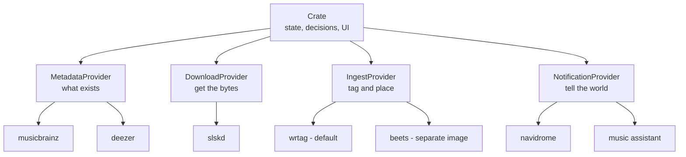

# Crate v2 — The Music Orchestrator

> **Status:** draft for review. Nothing here is committed to. Leave inline comments.

## The thesis

Crate v1 tried to do everything: find music, download it, tag it, organize it, tell other apps about it.
It's mediocre at the last three because they aren't the point.

Crate v2 does one thing: **it decides what music you should have, and orchestrates the tools that get it there.**
Everything else becomes a provider.



Crate owns: the database, the watch/wanted state machine, the scheduler, quality-tier decisions,
search-to-candidate scoring, and the UI. That's the product.

## Scope

### Deleted

| Package | Replaced by |
| --- | --- |
| `internal/services/tagger` | IngestProvider |
| `internal/services/organizer` | IngestProvider |
| `internal/services/importer` | IngestProvider (`Identify`) + crate-side reconciliation |
| `internal/naming` | IngestProvider (wrtag/beets own path templates) |
| `internal/services/navidrome` | NotificationProvider |
| `internal/services/musicassistant` (notifier half) | NotificationProvider |
| `internal/services/slskd` (as a hardcoded dependency) | DownloadProvider |

No compatibility shims. No "built-in" fallback provider. v2 is a clean break.

### Built

1. **Release-candidate pipeline** (phase 0 — needed to dogfood everything else)
2. **`IngestProvider`** gRPC contract + `provider-wrtag` shipped in the image
3. **`NotificationProvider`** gRPC contract + navidrome/music-assistant providers
4. **`DownloadProvider`** gRPC contract + `provider-slskd`
5. **State-machine refactor** — ownership moves off `file_path` onto provider refs
6. **`crate-ingest-beets`** — separate Docker image, documented, not shipped in the main image

---

## Phase 0 — Release candidates

Needed first so v2 can be tested live before it's released. Two concrete bugs block it today.

**`.github/workflows/ci.yml:108`** tags `type=raw,value=latest` unconditionally — an RC tag would move
`latest` to a pre-release image and auto-upgrade everyone on `:latest`.

```yaml
type=raw,value=latest,enable=${{ !contains(github.ref_name, '-') }}
```

`type=semver,pattern={{major}}.{{minor}}` already no-ops on prereleases (docker/metadata-action skips
partial patterns for them), so `2.0` won't move. No change needed there.

**`.github/workflows/release.yml`** calls `gh release create --generate-notes` with no `--prerelease`,
so an RC would publish as a full GitHub release.

```yaml
gh release create "${{ github.ref_name }}" --generate-notes \
  ${{ contains(github.ref_name, '-') && '--prerelease' || '' }}
```

**Convention:** `v2.0.0-rc.1` → image `ghcr.io/theoutdoorprogrammer/crate:2.0.0-rc.1`.
The NAS compose file pins the RC tag directly; `latest` stays on v1 until v2 ships.

---

## The IngestProvider contract

Crate hands over a file and everything it already knows. The provider tags it, places it,
and reports back where it went.

### Methods

| Method | Kind | Purpose |
| --- | --- | --- |
| `Info` | unary | Name, version, capabilities (see below) |
| `Place` | unary | **Destructive.** File + known metadata in → final location + ref out |
| `Identify` | **server stream** | Read a path, report what each file appears to be |
| `Resolve` | unary | Ref in → current path + exists. For files the provider moved later |
| `Remove` | unary | Delete a file *through* the provider so its own DB stays consistent |

### Why `Remove` exists

Quality upgrades today delete the old file and drop the new one in its place. If beets owns
placement, crate deleting a file leaves a dangling row in beets' library. `Remove(ref)` lets the
provider do its own cleanup. Same for track rejection (`internal/services/reject`).

### Why `Identify` streams

A library scan over 100k files through a Python process at MusicBrainz's 1 req/sec is measured in
hours. Batching is the provider's problem, but crate needs progress and partial results or the UI
is a spinner. Streaming gives both, and lets a scan be cancelled.

### Why `Identify` needs a read-only flag

`POST /api/library/import` is non-destructive today — people click it to adopt an existing
collection. At v2 that same button hands files to a tool that moves things. First run must be able
to say look-don't-touch. This is a flag on the request, not a separate RPC.

### Crate passes what it knows

Crate downloaded that file *because* it was watching a specific release. The request carries
`known_metadata` (artist, album, track, MBID, provider) so the ingest provider can skip matching
entirely. Without this, wrtag and beets re-derive metadata crate already holds — and do it worse.
Verified: `beet import -q` with the **exact MBID supplied** still skipped, because 3-of-14 tracks
present tripped `missing_tracks`.

### Capability negotiation via `Info`

Same pattern the metadata providers already use.

| Capability | Meaning |
| --- | --- |
| `supports_batch` | Wants whole releases, not single tracks |
| `offline_identify` | Can identify from local tags with no network |
| `stable_refs` | Refs survive the provider moving files (beets: yes via MBID; a dumb provider: path only) |

**The per-track vs per-album mismatch is real.** Crate downloads one track at a time; wrtag and beets
are album-oriented and partial albums are exactly what trips their matchers. Providers that declare
`supports_batch` get `PlaceRelease(files[], release_meta)`; the rest get per-track `Place`.

### Hard boundary: providers never write to crate's DB

The provider says *what a file appears to be*. Crate decides what that means.

Entity creation needs provider IDs, ranks, and artwork from the **metadata** providers — an ingest
provider has no access to that registry and shouldn't. So `Identify` returns
`{path, title, artist, album, mbid, confidence}` and crate runs its own matching ladder
(recording ID → release-track ID → title-within-album) against its own tables.

This is the same boundary metadata providers already respect: they return data, crate persists it.

---

## The state-machine refactor

**This is the actual work. The gRPC plumbing is the easy part.**

Today ownership is welded to the filesystem:

- All three code paths that set `status = 'owned'` write `file_path` in the same statement
- `scheduler.checkFileIntegrity` stats every owned track and demotes it to `wanted` when the file is gone
- `FindTrackByPath` (the Music Assistant reject watcher) joins on `file_path`
- Quality upgrades delete the old file at its known path
- `library.Contains` gates every destructive operation

If a provider owns placement, every one of those breaks.

### The change

`tracks` gains `ingest_provider` + `ingest_ref`, mirroring how entities already store
`provider` + `provider_id` for metadata. `file_path` **stays as a cache**, not as truth —
so the reject watcher doesn't need a gRPC round-trip per websocket event — and `Resolve(ref)`
is the authority when the cache is stale.

`checkFileIntegrity` stops stat-ing paths and calls `Resolve` instead. A file the provider says is
gone demotes to `wanted`; a file that merely *moved* updates the cache. **Today that same code would
see a beets-moved file as missing and re-download it forever.**

### Migration for existing v1 users

Their library is already organized by crate's naming template, `file_path` is populated, entities
exist. v2 first-run does an `Identify` pass over the existing library to establish refs. Until that
completes, tracks have a path but no ref — needs a state for that, and the integrity check must not
reap them in the meantime.

---

## NotificationProvider

The cheapest of the three — the interface already exists in all but name:

```go
type PostDownloadNotifier interface {
    TriggerScan(ctx context.Context)
}
```

Navidrome and Music Assistant already implement exactly this. Lifting it to gRPC is close to
mechanical, which makes it the right place to prove the v2 provider pattern before touching the
state machine.

**Not mechanical:** the Music Assistant **reject watcher** is not a notifier. It's a persistent
websocket that pushes *inbound* signals (user dropped a track in the reject playlist → crate rejects
it). That's a second capability. Either NotificationProvider grows a server-stream `Events` method,
or the reject watcher stays in crate core. **Open question — see below.**

---

## DownloadProvider

Shaped for slskd. slskd stays a first-class citizen; other implementations figure it out.

That's a deliberate choice and it should be written down, because the contract is going to be
Soulseek-shaped: peer search with per-user candidate scoring, quality tiers, min bitrate, negative
keywords, per-(user,file) blacklisting, per-user shadow bans, requeue cooldowns, max auto-queue.
A torrent or usenet provider could not implement half of it meaningfully.

**Open question:** where does the split land? Two options:

- **Thin** — provider does search + fetch; crate keeps scoring, blacklists, cooldowns.
  Keeps crate's hard-won download logic (and its `TestScoringBalance` invariants) intact.
  Providers stay simple. Least risk.
- **Thick** — provider owns candidate selection too; crate just says "get me this track."
  More genuinely pluggable, but every provider re-implements scoring, and crate's tier system
  becomes advisory.

Recommend **thin**. The scoring system is one of crate's actual differentiators and giving it away
buys pluggability nobody has asked for.

---

## Packaging

### wrtag

wrtag **does not speak crate's gRPC**, so `provider-wrtag` is a shim binary that drives it.

wrtag is **GPL-3.0**. Crate is MIT. Separate processes over a documented protocol is aggregation,
not linking — **crate itself stays MIT regardless**. But the shim's own license depends on how it's
built:

- Shim **imports wrtag Go packages** → the shim binary is GPL-3.0, and GPL code lives in this repo
- Shim **shells out to the `wrtag` binary** → shim can stay MIT

Recommend shelling out, purely to keep the repo single-licensed. **Open question below.**

Also worth stating plainly: wrtag is 405 stars with essentially one maintainer, and as the sole
required ingest provider its bugs become crate's bugs with no fallback. That's an acceptable risk —
but it should be an accepted one, not a discovered one.

### beets

Separate image: `ghcr.io/theoutdoorprogrammer/crate-ingest-beets`. Python never enters the main
image. Users run it alongside and point crate at it with the existing external-provider syntax:

```text
CRATE_INGEST_PROVIDER=beets:external:crate-ingest-beets:50061
```

beets is **MIT** — no licensing constraint at all.

**Where beets actually earns its place:** it's *weak* at ingest (crate already knows the answer, and
quiet-mode only auto-applies below a 0.04 distance threshold — everything else silently skips with
exit code 0) but *excellent* at `Identify`, which is its entire reason to exist. The provider should
lean on that asymmetry: use `known_metadata` to place, and beets' matcher to identify.

---

## Breaking changes for v1 users

| Change | Impact |
| --- | --- |
| `naming_template` setting stops working | **This was issue #1.** Users who configured a layout must reconfigure it in wrtag. Existing files are never renamed, so old and new layouts coexist. |
| `navidrome_*` / `music_assistant_*` settings move to provider config | Settings migration needed, or they re-enter them |
| Tagging behavior changes | ADR-0004's non-destructive guarantee is now wrtag's promise, not crate's. Needs verification that wrtag preserves ReplayGain + MusicBrainz IDs the way the current tagger does. |
| First run does a full library `Identify` pass | Slow on large libraries. Needs a progress UI. |

**Unaffected:** the Lidarr shim (`internal/api/lidarr.go`) — it translates to crate's core, which
still exists.

**Needs a decision:** the `local` provider + ADR-0007 reconcile/manual-link machinery
(`internal/api/reconcile.go`, `manual_link.go`) is built on the importer. That logic is *crate-side*
reconciliation, so it should survive — fed by `Identify` results instead of the importer's own tag
scan. But it's real surface area and it isn't free.

---

## Open questions

1. **Reject watcher** — does `NotificationProvider` grow a server-stream `Events` method, or does the
   Music Assistant websocket stay in crate core? (Growing it makes the contract bidirectional;
   keeping it means MA is both a provider and a core integration.)
2. **DownloadProvider split** — thin or thick? (Recommend thin.)
3. **wrtag shim** — import the packages (GPL in the repo) or shell out (MIT)? (Recommend shell out.)
4. **Ingest ref format** — opaque provider string, or does crate mandate something MBID-shaped?
   Opaque is more flexible; mandated is easier to debug and survives a provider swap.
5. **ADR-0007 machinery** — port to `Identify`, or drop it in v2?
6. **Does `NotificationProvider` justify its own contract**, or is it a special case of a generic
   webhook? Two implementations may not warrant a gRPC surface.

---

## Sequencing

| Phase | What | Why this order |
| --- | --- | --- |
| 0 | RC pipeline | Can't dogfood v2 without it |
| 1 | `NotificationProvider` | Interface already exists; proves the pattern with near-zero blast radius |
| 2 | `IngestProvider` contract + `provider-wrtag` | The hard one |
| 3 | State-machine refactor | Must land with phase 2 — they're the same change |
| 4 | `crate-ingest-beets` image | Independent; validates the contract against a second implementation |
| 5 | `DownloadProvider` + `provider-slskd` | Highest risk, least external demand. Last. |
| 6 | Rebrand + docs + `site/` | README, CLAUDE.md, site/index.html, site/docs.html |

Phases 2 and 3 are one unit of work, not two. Everything else can ship as an RC independently.

## ADRs to write

- Ingest as a provider (why we exited the tagging/organizing business)
- Ownership by provider ref instead of file path
- DownloadProvider shaped for Soulseek (why we didn't pre-generalize)
