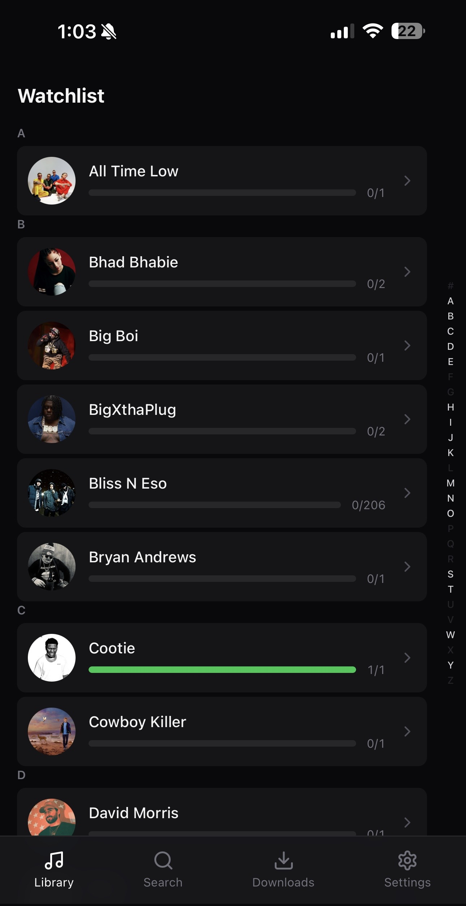
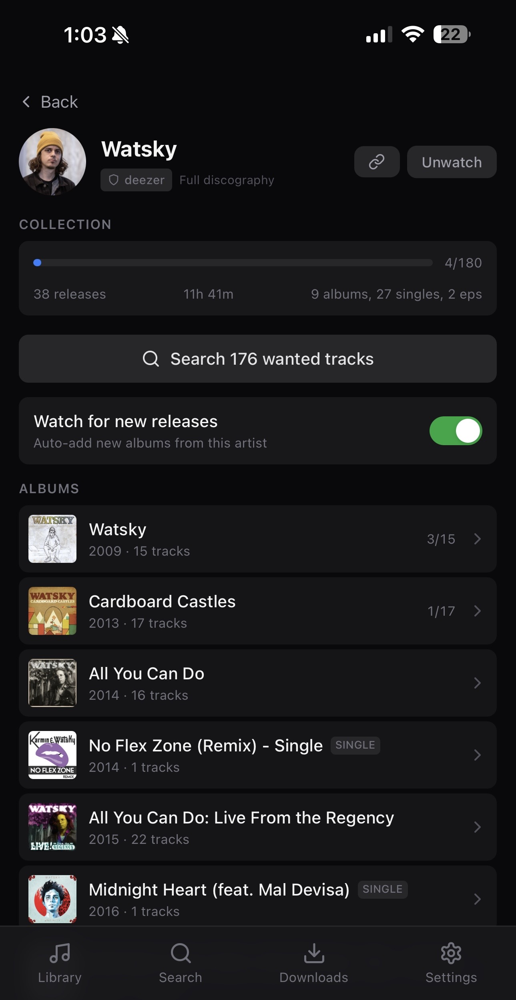
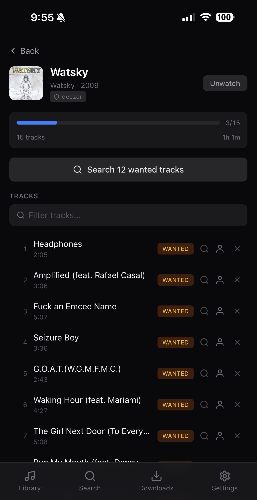
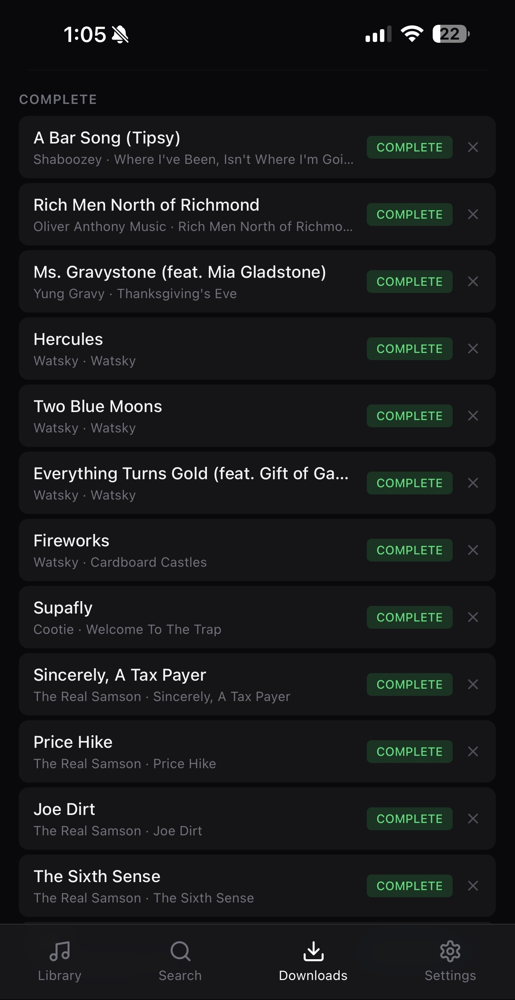

<p align="center">
  
</p>

<h1 align="center">Crate</h1>

<p align="center">
  <em>Dig deeper.</em>
</p>

<p align="center">
  Self-hosted music manager. Search for artists via pluggable providers (MusicBrainz, Deezer, or custom gRPC), watch their discographies, and automatically download via <a href="https://github.com/slskd/slskd">slskd</a> (Soulseek). Optional <a href="https://www.navidrome.org/">Navidrome</a> integration triggers library scans so new music appears immediately. Mobile-first UI.
</p>

<p align="center">
  
  &nbsp;
  
  &nbsp;
  
  &nbsp;
  
</p>

## Quick Start

Create a `docker-compose.yml` and run `docker compose up -d`:

```yaml
services:
  crate:
    image: ghcr.io/theoutdoorprogrammer/crate:latest
    ports:
      - "6969:6969"
    volumes:
      - ./crate:/app/data             # SQLite databases
      - ./slskd/downloads:/app/downloads  # Must match slskd's download dir
      - ./library:/app/library       # Organized music library
    environment:
      - CRATE_SLSKD_URL=http://slskd:5030
      - CRATE_SLSKD_API_KEY=your_api_key
    depends_on:
      - slskd
    restart: unless-stopped

  slskd:
    image: slskd/slskd:latest
    ports:
      - "5030:5030"
    volumes:
      - ./slskd:/app                  # slskd data (config, downloads)
      - ./library:/music             # Share your library on Soulseek
    environment:
      - SLSKD_REMOTE_CONFIGURATION=true
      - SLSKD_API_KEY=your_api_key
      - SLSKD_SOULSEEK_USERNAME=your_soulseek_username
      - SLSKD_SOULSEEK_PASSWORD=your_soulseek_password
    restart: unless-stopped
```

Replace `your_api_key` (must match in both services), `your_soulseek_username`, and `your_soulseek_password` with your own values.

> **Important:** Crate's downloads volume (`/app/downloads`) must point to the same host directory that slskd writes completed downloads to. With the config above, slskd stores downloads under `./slskd/downloads/` and crate reads from the same path. If these don't match, crate won't find downloaded files.

Open `http://localhost:6969`.

## Features

- **Pluggable providers** -- search via MusicBrainz, Deezer, or custom gRPC providers. Switch providers on the fly from the search UI.
- **Search** -- find artists, browse their full discography with metadata
- **Watch** -- save artists, albums, or individual tracks to your library
- **Download** -- searches slskd (Soulseek), scores all results using a unified scoring system, and downloads the best match automatically
- **Smart scoring** -- tier-based quality scoring from your configured priority list, artist name matching bonus, free upload slot bonus, and queue-length-aware scoring using inverse decay. Quality always dominates; availability tips close calls.
- **Retry with backoff** -- failed downloads retry with backoff (5m → 15m → 30m → 1h, gives up after ~2h). Failed sources are blacklisted per-user per-file so they're never retried.
- **Shadow banning** -- users who go offline mid-transfer or whose queued downloads stall are temporarily blocked (configurable duration, default 60min). Different from permanent file blacklists -- shadow bans expire automatically.
- **State-aware stale detection** -- detects stalled downloads with timeouts tuned to the transfer state: actively transferring (5min), queued/waiting for a slot (30min), or requested (10min). Queued stalls trigger shadow bans; active transfer stalls blacklist the specific file.
- **Blocked sources management** -- view and remove blacklisted files and shadow-banned users from the Settings UI
- **Manual search** -- browse all slskd results for a track, see scores/format/queue info, and pick which one to download
- **Quality tiers** -- configure priority-ordered quality tiers (e.g. FLAC > MP3 320 > MP3 256) with an optional fallback toggle to reject files outside your configured tiers. Scheduler scans one artist per day and re-queues tracks that can be upgraded.
- **Navidrome integration** -- optionally trigger a Navidrome library scan after each download so new files appear immediately
- **Organize** -- moves completed files to `library/{Artist}/{Album (Year)}/{nn} - {Title}.ext`
- **Metadata tagging** -- writes ID3v2 (MP3), Vorbis comments (FLAC), and RIFF INFO (WAV) with artist, album, track, year, and cover art (MP3/FLAC)
- **New release detection** -- opt-in per artist, auto-adds albums released after the feature is enabled
- **File integrity** -- daily check that owned tracks still exist on disk; reverts to "wanted" if missing
- **Activity log** -- tracks all download activity (search, download, complete, fail) in a separate SQLite DB with configurable retention
- **Relink** -- reassign any artist to a different provider without losing your library data
- **Scheduled scans** -- re-queues wanted tracks and checks for new releases on a configurable interval
- **Duplicate guard** -- prevents duplicate artists, albums, and download queue entries
- **Settings UI** -- configure providers, slskd connection, Navidrome, quality tiers, quality fallback, shadow ban duration, library path, scan interval, and more from the browser
- **Mobile-first** -- responsive layout with bottom nav on mobile, sidebar on desktop

## Lidarr API Compatibility

Crate ships a Lidarr v1 API shim at `/api/v1/` so iOS apps like [Helmarr](https://apps.apple.com/us/app/helmarr/id1638624921) can manage your library as if Crate were Lidarr. No extra configuration needed -- point the app at your Crate URL with any API key and it works.

### Concept mapping

Lidarr and Crate model things differently. The shim translates between them:

| Lidarr concept | Crate equivalent | Notes |
|---|---|---|
| Monitor "all" | Artist status `watched` | Full discography tracked |
| Monitor "latest" | Watch newest album + enable new releases | Most recent album by year, future albums auto-added |
| Quality profile | "Crate Quality" | Crate uses priority-ordered quality tiers instead of Lidarr-style profiles |
| Metadata profile | Active provider name | Shows whichever provider is set as primary (MusicBrainz, Deezer, etc.) |
| Root folder | `CRATE_LIBRARY_PATH` | Library directory with real disk stats |
| Monitored album | Album status `watched` | Tracks set to `wanted` |
| Unmonitored album | Album status `ignored` | Tracks cascade to `ignored` (preserves `owned`/`downloading`) |
| ArtistSearch command | Queue all wanted tracks | Same as "Search wanted tracks" in the UI |
| AlbumSearch command | Queue album's wanted tracks | Same as "Search wanted tracks" on the album page |
| "Search for missing albums" on add | Auto-queue after watch | Queues all wanted tracks immediately |

### Supported endpoints

System status, health, disk space, quality/metadata profiles, root folders, custom filters, calendar, history, wanted/missing, queue, search, artist CRUD, album CRUD (including monitor toggle), track listing, and commands (ArtistSearch, AlbumSearch). Interactive search is not supported -- use the Crate UI for manual file selection.

### Auth

The shim accepts any API key in the `X-Api-Key` header or `apikey` query parameter. Crate has no built-in auth -- use a reverse proxy if you need access control.

### Tested with

- [Helmarr](https://apps.apple.com/us/app/helmarr/id1638624921) (iOS) -- full artist/album management, search, monitoring

Contributions to expand Lidarr API coverage are welcome.

## Roadmap

- [ ] **Import existing library** -- see [DATABASE.md](DATABASE.md) for schema docs to write custom importers

## Configuration

| Env var | Default | Description |
|---|---|---|
| `CRATE_PORT` | `6969` | HTTP port |
| `CRATE_DB_PATH` | `./crate.db` | SQLite database path |
| `CRATE_CACHE_PATH` | `./cache.db` | Provider cache database path |
| `CRATE_ACTIVITY_PATH` | `./activity.db` | Activity log database path |
| `CRATE_SLSKD_URL` | `http://localhost:5030` | slskd API base URL |
| `CRATE_SLSKD_API_KEY` | -- | slskd API key |
| `CRATE_DOWNLOADS_DIR` | `./downloads` | Where slskd puts completed files |
| `CRATE_LIBRARY_PATH` | `./library` | Where organized files are moved |
| `CRATE_SCAN_INTERVAL` | `6h` | How often to auto-queue wanted tracks and check for new releases |
| `CRATE_PROVIDERS` | `musicbrainz:./provider-musicbrainz:50051,deezer:./provider-deezer:50052` | Provider configuration |

Additional settings (default provider, slskd connection, Navidrome, quality tiers, library path, scan interval) can be configured from the Settings page in the UI.

## Auth

Crate does not include built-in authentication. If you need to restrict access, put a reverse proxy with auth in front of it (e.g. [Cloudflare Zero Trust](https://www.cloudflare.com/zero-trust/), Authelia, or nginx basic auth).

## Stack

- **Backend**: Go + Chi + SQLite (pure Go, no CGO)
- **Frontend**: React + TypeScript + Vite + Tailwind
- **Providers**: MusicBrainz + Deezer via gRPC (extensible)
- **Tagging**: ID3v2 (MP3), Vorbis comments (FLAC), RIFF INFO (WAV)
- **Downloads**: slskd (Soulseek client)
- **Deployment**: Docker (single multi-stage container)

## Supported Formats

| Format | Download | Metadata tagging | Cover art |
|--------|----------|-----------------|-----------|
| FLAC   | Yes      | Yes (Vorbis comments) | Yes |
| MP3    | Yes      | Yes (ID3v2) | Yes |
| WAV    | Yes      | Yes (RIFF INFO) | No |
| OGG    | Yes      | No | No |
| Opus   | Yes      | No | No |
| AAC    | Yes      | No | No |
| M4A    | Yes      | No | No |

All formats are downloaded, organized into the library folder, and tracked in the database. Formats without tagging support are still fully functional -- they just won't have embedded metadata written by Crate.
